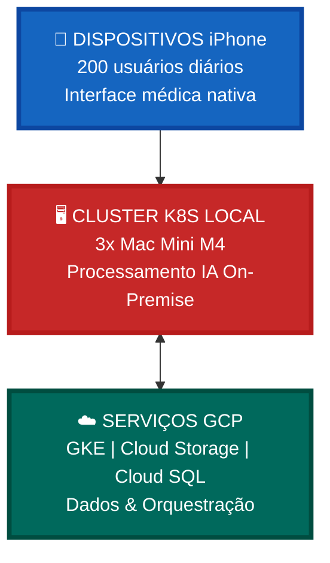
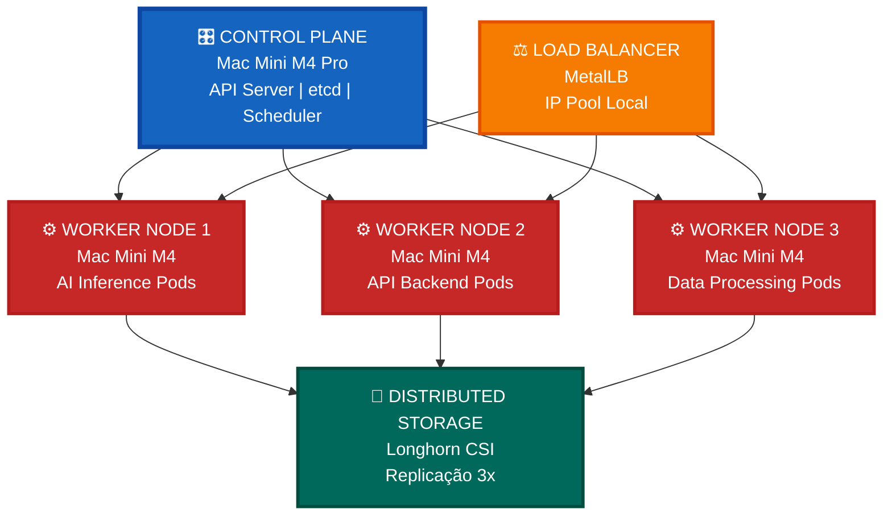
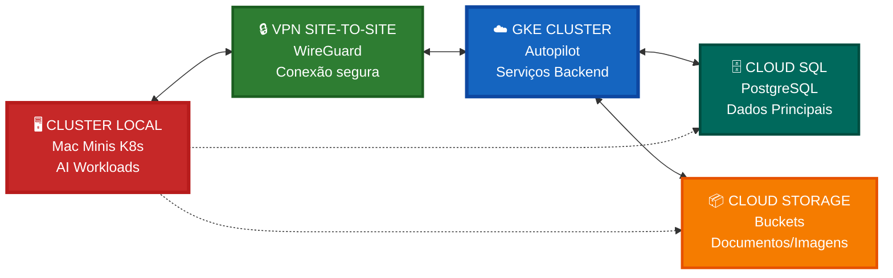
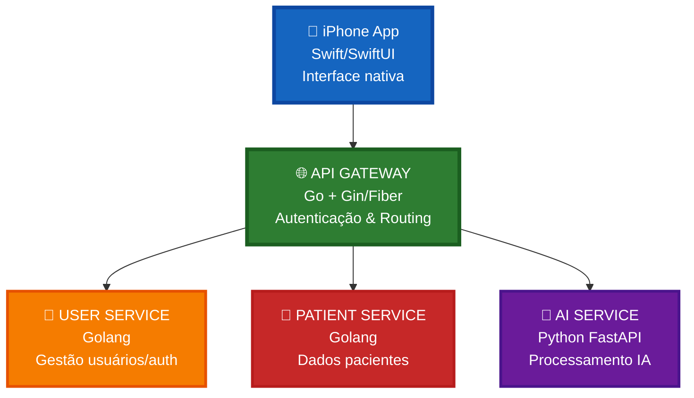
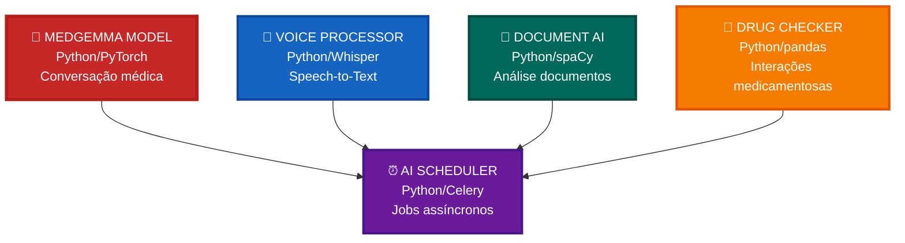
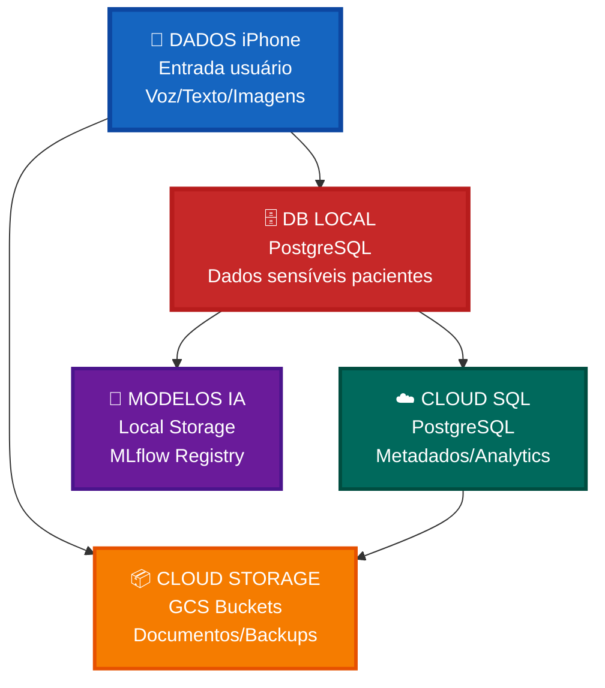
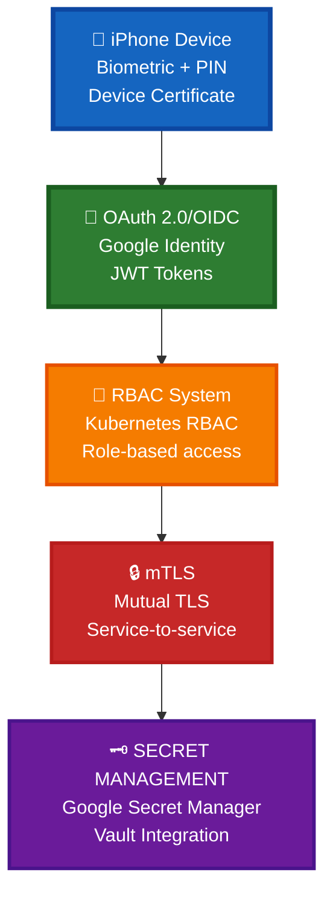
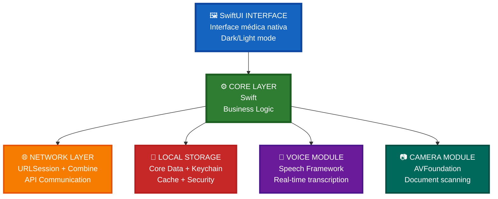
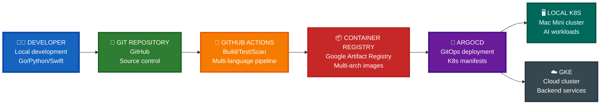
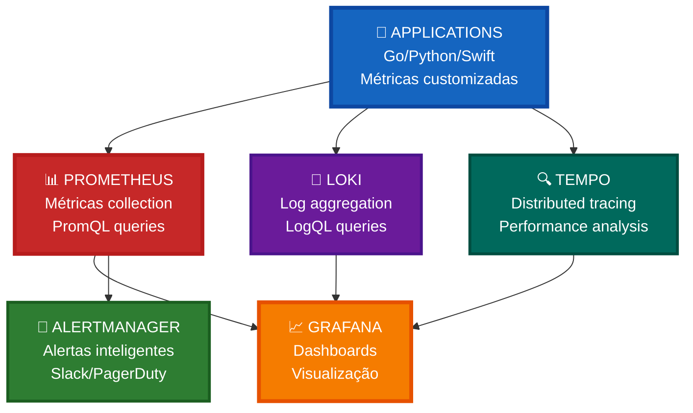

# Prontuário - Arquitetura Híbrida Local/Cloud

## 🎯 Visão Geral da Arquitetura

Prontuário utiliza uma arquitetura híbrida que combina processamento de IA local em Mac Minis com serviços em nuvem GCP, otimizada para dispositivos iPhone únicos e operações hospitalares de 200 usuários diários.

---

## 🏗️ Arquitetura de Alto Nível

---

# 🖥️ INFRAESTRUTURA LOCAL KUBERNETES

## 🔧 Cluster Mac Mini Local

### **Especificações Hardware**

| **Componente** | **Especificação** | **Quantidade** | **Função** |
|----------------|-------------------|----------------|------------|
| **🖥️ Mac Mini M4** | **CPU 10-core, GPU 10-core, 24GB RAM** | **3 unidades** | **Nós Worker K8s** |
| **🖥️ Mac Mini M4 Pro** | **CPU 12-core, GPU 16-core, 32GB RAM** | **1 unidade** | **Nó Control Plane** |
| **💾 Network Storage** | **2TB NVMe cada** | **4 unidades** | **Armazenamento distribuído** |
| **🌐 Network Switch** | **10Gb Ethernet** | **1 unidade** | **Rede cluster** |

### **Configuração Kubernetes**

---

# ☁️ SERVIÇOS GOOGLE CLOUD PLATFORM

## 🔗 Integração GCP/GKE

### **Serviços Utilizados**

| **Serviço GCP** | **Função** | **Configuração** |
|-----------------|------------|------------------|
| **🚀 GKE Autopilot** | **Orquestração Cloud** | **Multi-zona us-central1** |
| **🗄️ Cloud SQL** | **Banco Dados Principal** | **PostgreSQL 15, HA** |
| **📦 Cloud Storage** | **Armazenamento Objetos** | **Multi-regional, HIPAA** |
| **🔐 Secret Manager** | **Gestão Credenciais** | **Rotação automática** |
| **📊 Cloud Monitoring** | **Observabilidade** | **Métricas + Logs** |
| **🌐 Cloud Load Balancing** | **Distribuição Tráfego** | **Global HTTPS** |

### **Arquitetura Híbrida Local-Cloud**

---

# 📱 ARQUITETURA APLICAÇÃO

## 🎯 Stack Tecnológico

### **Backend Services (Golang)**

### **AI Workloads (Python)**

---

# 🗄️ ARQUITETURA DADOS

## 📊 Estratégia Dados Híbrida

### **Distribuição de Dados**

| **Tipo Dado** | **Localização** | **Tecnologia** | **Justificativa** |
|---------------|-----------------|----------------|-------------------|
| **🔒 Dados Pacientes Sensíveis** | **Local K8s** | **PostgreSQL + Encryption** | **Compliance LGPD** |
| **📊 Metadados & Analytics** | **Cloud SQL** | **PostgreSQL HA** | **Análises agregadas** |
| **📁 Documentos/Imagens** | **Cloud Storage** | **Buckets Regionais** | **Escalabilidade** |
| **🧠 Modelos IA** | **Local Storage** | **Longhorn CSI** | **Performance inference** |
| **📈 Logs/Métricas** | **Cloud Logging** | **Stackdriver** | **Observabilidade** |

### **Fluxo de Dados**

---

# 🔐 SEGURANÇA & COMPLIANCE

## 🛡️ Modelo Segurança Zero Trust

### **Autenticação & Autorização**

### **Compliance LGPD/HIPAA**

| **Requisito** | **Implementação** | **Tecnologia** |
|---------------|-------------------|----------------|
| **🔒 Criptografia em Repouso** | **AES-256** | **LUKS + TLS** |
| **🚀 Criptografia em Trânsito** | **TLS 1.3** | **cert-manager** |
| **📋 Auditoria Completa** | **Logs estruturados** | **Fluent Bit + Loki** |
| **🗑️ Direito ao Esquecimento** | **Soft delete + Purge** | **Kubernetes Jobs** |
| **📊 Relatórios Compliance** | **Dashboards automatizados** | **Grafana + Prometheus** |

---

# 📱 APLICAÇÃO IPHONE

## 🎯 Arquitetura Mobile

### **Aplicação iPhone Nativa**

### **Features iPhone App**

| **Feature** | **Tecnologia** | **Descrição** |
|-------------|----------------|---------------|
| **🎤 Documentação por Voz** | **Speech + NLP** | **Transcrição médica em tempo real** |
| **📱 Interface Médica** | **SwiftUI + HealthKit** | **UI otimizada para workflows médicos** |
| **🔒 Autenticação Biométrica** | **Face ID + Touch ID** | **Segurança máxima dispositivo** |
| **📊 Visualização Dados** | **Charts + Core Graphics** | **Gráficos laboratório/sinais vitais** |
| **📷 Scan Documentos** | **VisionKit + ML** | **OCR documentos médicos** |
| **🔄 Sync Offline** | **Core Data + CloudKit** | **Funcionamento sem conexão** |

---

# 🚀 DEPLOYMENT & DEVOPS

## 🔄 Pipeline CI/CD

### **GitOps Workflow**

### **Estratégia Deployment**

| **Ambiente** | **Localização** | **Estratégia** | **Rollback** |
|--------------|-----------------|----------------|--------------|
| **🧪 Development** | **Local K8s** | **Rolling update** | **Automático** |
| **🔍 Staging** | **GKE** | **Blue/Green** | **Manual approval** |
| **🏥 Production** | **Híbrido** | **Canary** | **Automatic rollback** |

---

# 📊 OBSERVABILIDADE

## 🔍 Monitoring Stack

### **Métricas & Alertas**

---

---

**🏥 ARQUITETURA HÍBRIDA PARA MÁXIMA PERFORMANCE E COMPLIANCE**

**📱 IPHONE-FIRST | 🖥️ K8S LOCAL | ☁️ GCP CLOUD**