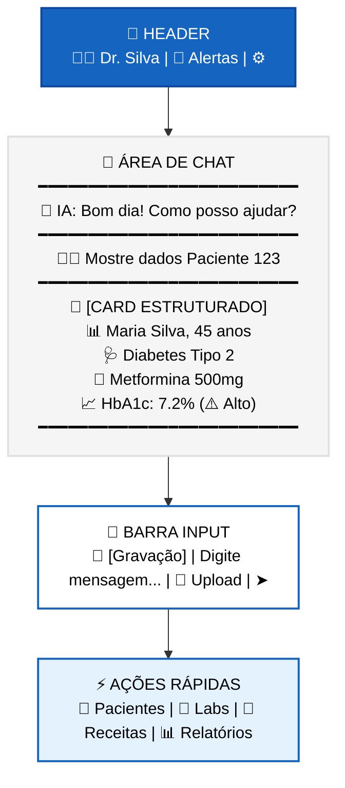
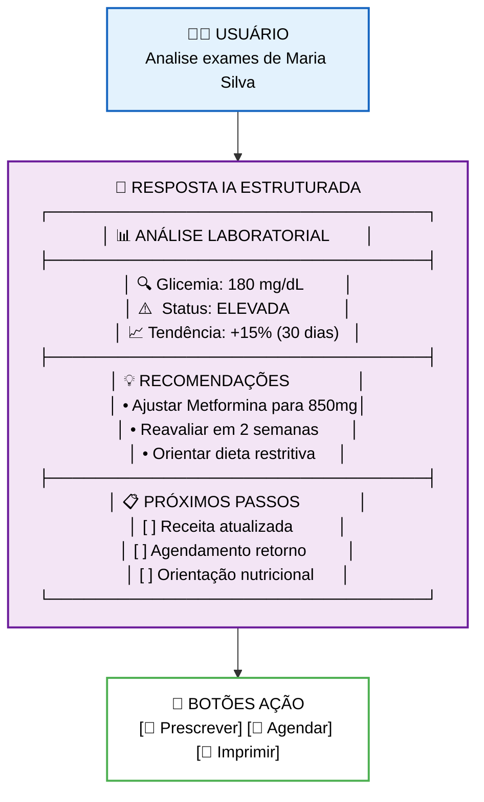
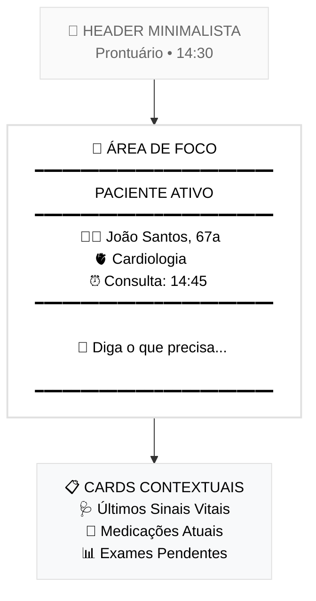
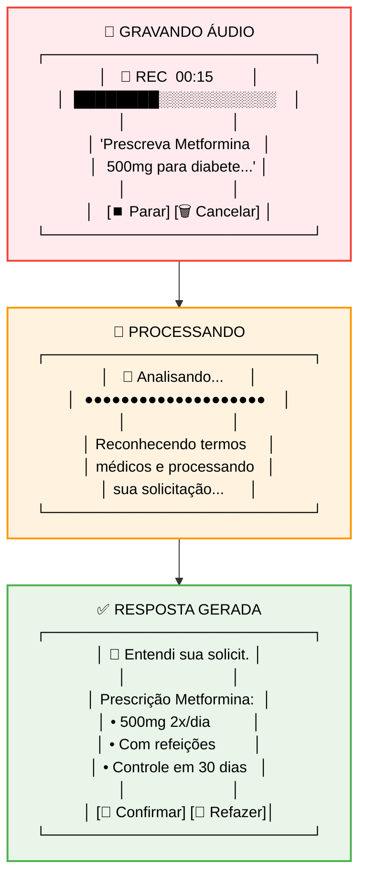
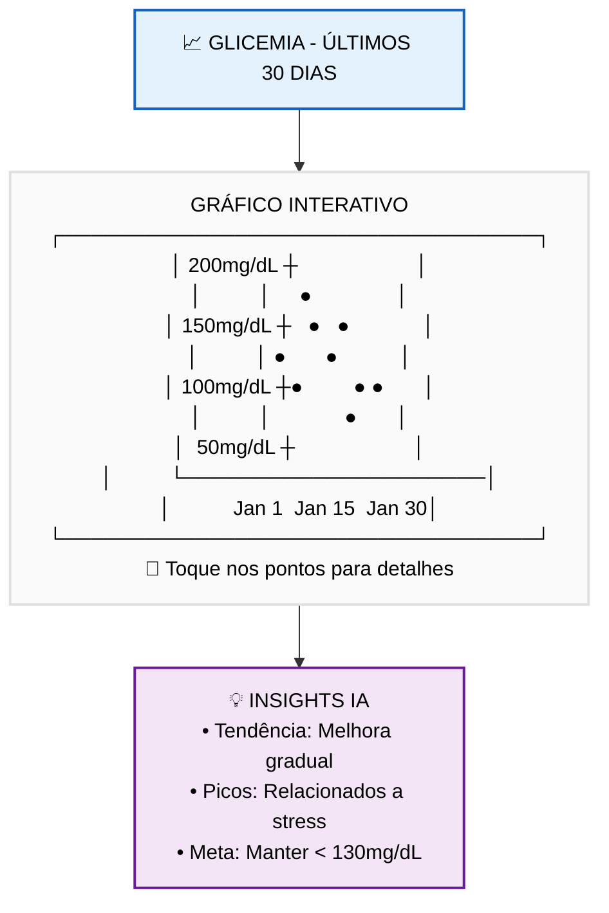
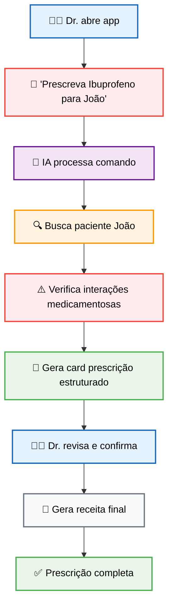

# 🎨 Design da Interface - Prontuário MVP

## 📱 Conceito de Design Híbrido

A interface do Prontuário combina os melhores elementos de três paradigmas de design para criar uma experiência médica otimizada:

| **Inspiração** | **Elementos Adotados** | **Aplicação Médica** |
|----------------|------------------------|----------------------|
| **💬 WhatsApp** | **Chat bubbles, threads, áudio** | **Conversas com IA médica, histórico pacientes** |
| **🤖 Gemini** | **Respostas estruturadas, code blocks** | **Planos tratamento, protocolos médicos** |
| **🧠 memOS** | **Interface limpa, foco cognitivo** | **Redução sobrecarga, workflow eficiente** |

---

## 🎨 Paleta de Cores Médica

### **Cores Primárias**

```
🔵 Azul Médico Principal: #1565C0 (Confiança, profissionalismo)
⚪ Branco Limpo: #FFFFFF (Clareza, higiene)
🔷 Azul Claro: #E3F2FD (Calma, serenidade)
⚫ Cinza Texto: #212121 (Legibilidade)
```

### **Cores de Status Médico**

```
🟢 Verde Sucesso: #4CAF50 (Resultados normais, sucesso)
🟡 Amarelo Alerta: #FF9800 (Atenção, resultados borderline)
🔴 Vermelho Crítico: #F44336 (Urgente, valores anormais)
🟣 Roxo IA: #6A1B9A (Respostas da IA médica)
```

---

## 📱 Wireframes das Telas Principais

### **1. Tela de Chat Principal (Inspirada em WhatsApp)**



### **2. Resposta Estruturada da IA (Inspirada em Gemini)**



### **3. Interface Limpa - Foco Cognitivo (Inspirada em memOS)**



---

## 🗨️ Componentes de Interface

### **Chat Bubble - Estilo WhatsApp Médico**

#### **Mensagem do Médico**
```
┌─────────────────────────────────────┐
│ 👨‍⚕️ Dr. Silva • 14:32                │
│ Prescreva Ibuprofeno 400mg para     │
│ Maria Silva                         │
│                              ✓✓ Lido │
└─────────────────────────────────────┘
```

#### **Resposta da IA Médica**
```
┌─────────────────────────────────────┐
│ 🤖 IA Médica • 14:32                │
│                                     │
│ 💊 PRESCRIÇÃO GERADA                │
│ ━━━━━━━━━━━━━━━━━━━━━━━━━━━━━━━━━━━  │
│ Paciente: Maria Silva (45a)         │
│ Medicamento: Ibuprofeno 400mg       │
│ Posologia: 1cp 8/8h por 5 dias     │
│ ⚠️ Verificado: Sem interações       │
│                                     │
│ [📄 Imprimir] [📧 Enviar] [✏️ Editar] │
└─────────────────────────────────────┘
```

### **Cards de Dados Estruturados - Estilo Gemini**

#### **Card de Paciente**
```
╭─────────────────────────────────────╮
│ 👤 DADOS DO PACIENTE                │
├─────────────────────────────────────┤
│ Nome: Maria Silva                   │
│ Idade: 45 anos                      │
│ Sexo: Feminino                      │
│ Registro: #12345                    │
├─────────────────────────────────────┤
│ 🏥 DEPARTAMENTO                     │
│ Endocrinologia - Sala 203           │
│ Dr. Roberto Silva                   │
├─────────────────────────────────────┤
│ 📅 ÚLTIMA CONSULTA                  │
│ 15/01/2024 - Controle diabetes     │
│ Próxima: 29/01/2024                │
╰─────────────────────────────────────╯
```

#### **Card de Exames**
```
╭─────────────────────────────────────╮
│ 🔬 RESULTADOS LABORATORIAIS         │
├─────────────────────────────────────┤
│ Data: 20/01/2024                    │
│                                     │
│ 🩸 Glicemia em Jejum                │
│ 180 mg/dL     ⚠️ ALTO (REF: 70-100) │
│                                     │
│ 🧪 HbA1c                           │
│ 7.2%          ⚠️ ALTO (REF: <7.0)   │
│                                     │
│ 💉 Insulina                         │
│ 15 mU/L       ✅ NORMAL (REF: 2-20) │
├─────────────────────────────────────┤
│ 🎯 AÇÃO REQUERIDA                   │
│ Ajuste medicação + dieta restritiva │
╰─────────────────────────────────────╯
```

---

## 🎤 Interação por Voz - Interface de Áudio

### **Estado de Gravação Ativa**



---

## 📊 Visualização de Dados Médicos

### **Gráfico de Tendência - Interface Limpa**



---

## 🔧 Estados de Interface

### **Estado de Loading - memOS Inspired**

```
┌─────────────────────────┐
│                         │
│    ●●●●●●●●●●●●●●●●●●●   │
│                         │
│   Consultando IA...     │
│                         │
│   Analisando dados do   │
│   paciente Maria Silva  │
│                         │
└─────────────────────────┘
```

### **Estado de Erro - Amigável**

```
┌─────────────────────────┐
│   ⚠️ Ops! Algo deu errado  │
│                         │
│ Não consegui processar  │
│ sua solicitação.        │
│                         │
│ [🔄 Tentar Novamente]    │
│ [🎤 Usar Voz]           │
│ [💬 Chat Texto]         │
└─────────────────────────┘
```

---

## 📱 Responsive Design - Adaptação Mobile

### **Layout Portrait (Vertical)**
```
┌─────────────────┐
│ 📱 Header       │
├─────────────────┤
│                 │
│  💬 Chat Area   │
│                 │
│     (Scroll)    │
│                 │
├─────────────────┤
│ 📝 Input + 🎤   │
├─────────────────┤
│ ⚡ Quick Actions │
└─────────────────┘
```

### **Layout Landscape (Horizontal)**
```
┌─────────────┬─────────────┐
│ 📱 Header   │             │
├─────────────┤ 📋 Context  │
│             │    Panel    │
│ 💬 Chat     │             │
│   Area      │ 📊 Charts   │
│             │             │
│ 📝 Input+🎤 │ 📋 Actions  │
└─────────────┴─────────────┘
```

---

## 🎯 Microinterações

### **Feedback Tátil (Haptic)**
- **🎤 Início gravação**: Haptic leve
- **✅ Ação confirmada**: Haptic sucesso  
- **⚠️ Erro/Alerta**: Haptic erro
- **📱 Nova mensagem**: Haptic notificação

### **Animações Suaves**
- **💬 Chat bubbles**: Fade in bottom-up
- **📊 Cards**: Slide in left-right  
- **🎤 Recording**: Pulse animation
- **⚡ Loading**: Gentle breathing animation

---

## 🧪 Protótipo de Fluxo Completo

### **Cenário: Prescrição de Medicamento**



---

## 📐 Especificações Técnicas

### **Tipografia**
- **Heading**: SF Pro Display Semibold 18-24pt
- **Body**: SF Pro Text Regular 16pt  
- **Caption**: SF Pro Text Regular 14pt
- **Monospace**: SF Mono Regular 14pt (dados médicos)

### **Espaçamento**
- **Padding**: 16px (padrão)
- **Margins**: 8px, 16px, 24px
- **Chat bubbles**: 12px padding interno
- **Card radius**: 12px border-radius

### **Acessibilidade**
- **Contraste**: WCAG AA compliant
- **Font scaling**: Suporte Dynamic Type
- **Voice Over**: Labels descritivos
- **Gesture navigation**: Suporte completo

---

## 🚀 Implementação SwiftUI

### **Componente Chat Bubble**
```swift
struct MedicalChatBubble: View {
    let message: MedicalMessage
    let isFromDoctor: Bool
    
    var body: some View {
        HStack {
            if isFromDoctor { Spacer() }
            
            VStack(alignment: .leading, spacing: 8) {
                HStack {
                    Image(systemName: isFromDoctor ? "stethoscope" : "brain.head.profile")
                    Text(isFromDoctor ? "Dr. Silva" : "IA Médica")
                        .font(.caption)
                        .foregroundColor(.secondary)
                }
                
                Text(message.content)
                    .font(.body)
                    .padding(.horizontal, 16)
                    .padding(.vertical, 12)
                    .background(
                        RoundedRectangle(cornerRadius: 18)
                            .fill(isFromDoctor ? Color.blue : Color.purple.opacity(0.1))
                    )
                    .foregroundColor(isFromDoctor ? .white : .primary)
            }
            
            if !isFromDoctor { Spacer() }
        }
        .padding(.horizontal)
    }
}
```

Esta especificação de design garante uma interface médica **familiar** (WhatsApp), **inteligente** (Gemini), e **focada** (memOS) para máxima eficiência no ambiente hospitalar. 