# 🎨 Design da Interface - Prontuário MVP

## 📱 Conceito de Design Híbrido

A interface do Prontuário combina os melhores elementos de três paradigmas de design para criar uma experiência médica otimizada:

| **Inspiração** | **Elementos Adotados** | **Aplicação Médica** |
|----------------|------------------------|----------------------|
| **💬 WhatsApp** | **Chat bubbles, threads, áudio** | **Conversas com IA médica, histórico pacientes** |
| **🤖 Gemini** | **Respostas estruturadas, code blocks** | **Planos tratamento, protocolos médicos** |
| **🧠 memOS** | **Interface limpa, foco cognitivo** | **Redução sobrecarga, workflow eficiente** |

---

## 🎨 Paleta de Cores Médica

### **Cores Primárias**

```
🔵 Azul Médico Principal: #1565C0 (Confiança, profissionalismo)
⚪ Branco Limpo: #FFFFFF (Clareza, higiene)
🔷 Azul Claro: #E3F2FD (Calma, serenidade)
⚫ Cinza Texto: #212121 (Legibilidade)
```

### **Cores de Status Médico**

```
🟢 Verde Sucesso: #4CAF50 (Resultados normais, sucesso)
🟡 Amarelo Alerta: #FF9800 (Atenção, resultados borderline)
🔴 Vermelho Crítico: #F44336 (Urgente, valores anormais)
🟣 Roxo IA: #6A1B9A (Respostas da IA médica)
```

---

## 📱 Wireframes das Telas Principais

### **1. Tela de Chat Principal (Inspirada em WhatsApp)**

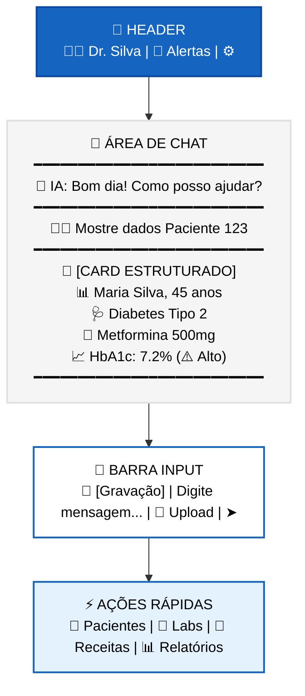

### **2. Resposta Estruturada da IA (Inspirada em Gemini)**

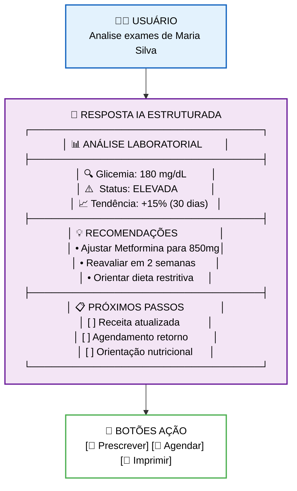

### **3. Interface Limpa - Foco Cognitivo (Inspirada em memOS)**

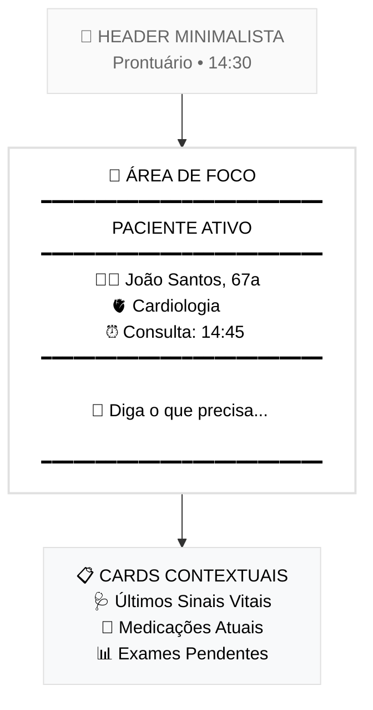

---

## 🗨️ Componentes de Interface

### **Chat Bubble do Médico - Estilo WhatsApp**

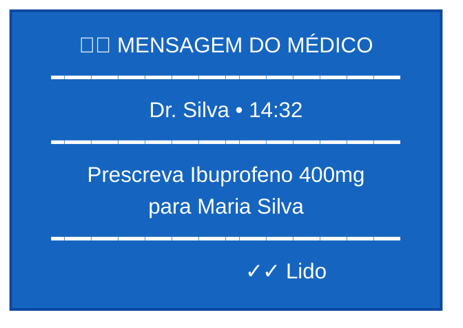

### **Chat Bubble da IA - Estilo Gemini Estruturado**

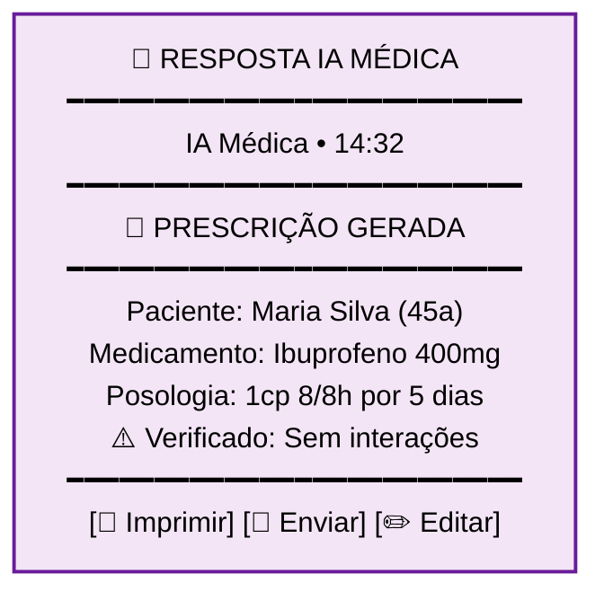

### **Card de Paciente - Estilo Gemini Dados Estruturados**

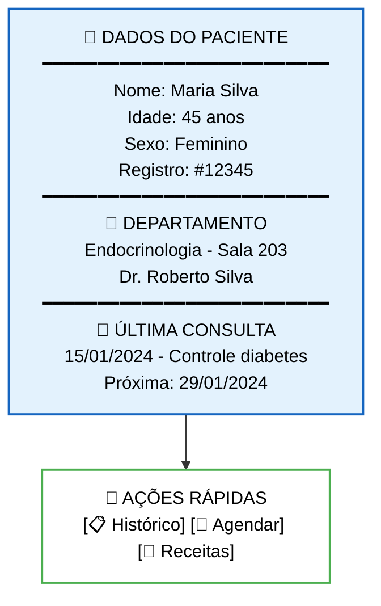

### **Card de Exames - Resultados com Status Visual**

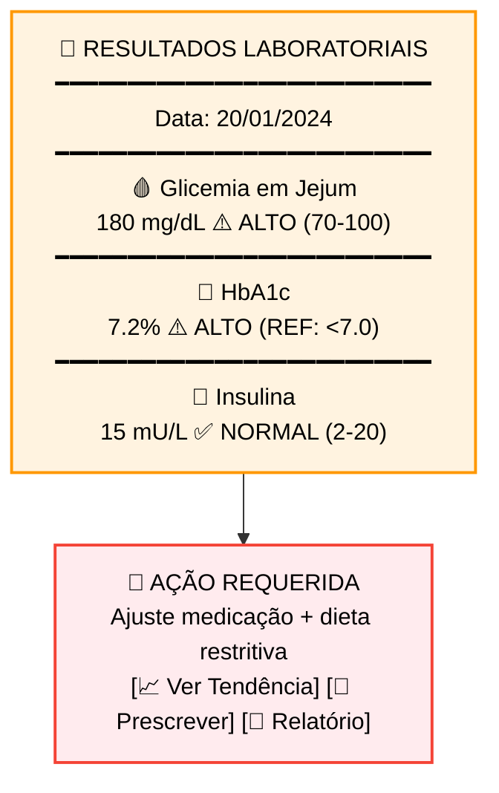

---

## 🎤 Interação por Voz - Interface de Áudio

### **Estado de Gravação Ativa**

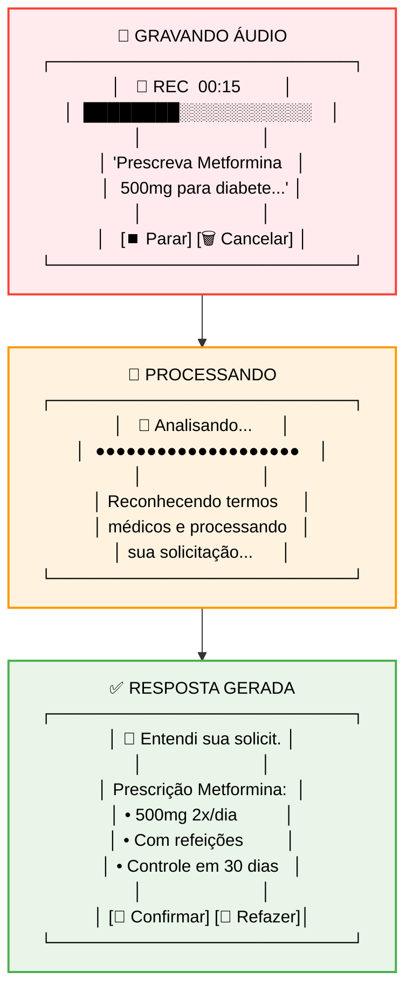

---

## 📊 Visualização de Dados Médicos

### **Gráfico de Tendência - Interface Limpa**

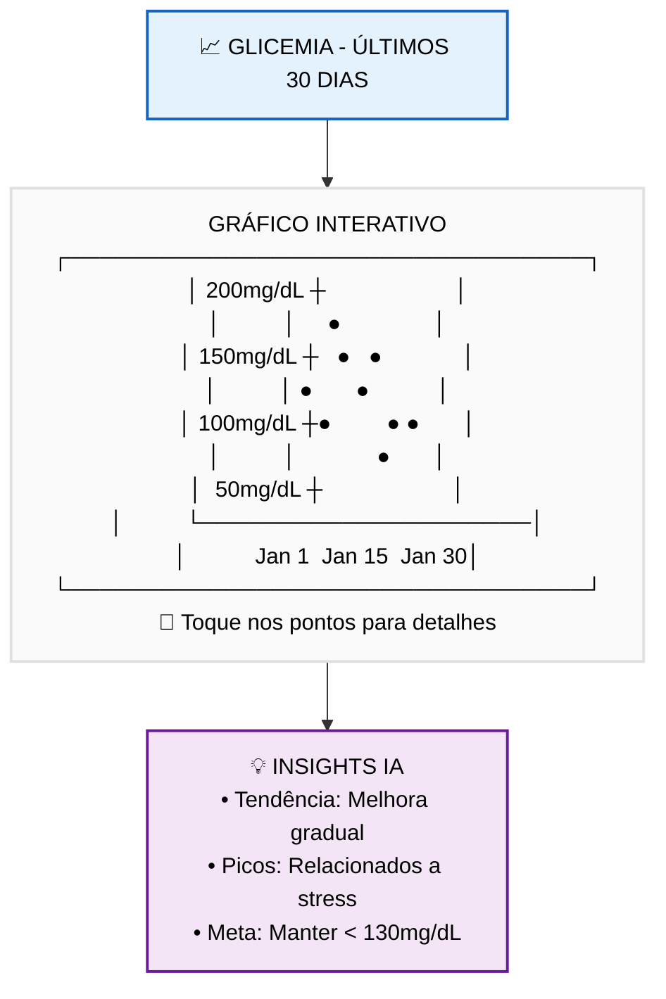

---

## 🔧 Estados de Interface

### **Estado de Loading - memOS Clean & Focused**

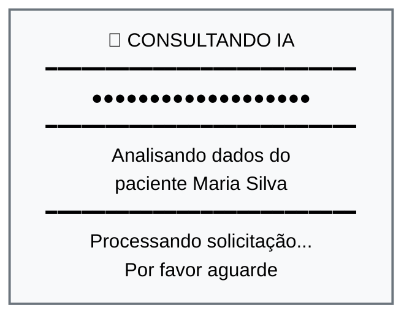

### **Estado de Erro - Interface Amigável**

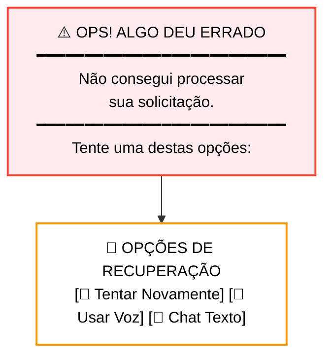

### **Estado de Sucesso - Confirmação Visual**

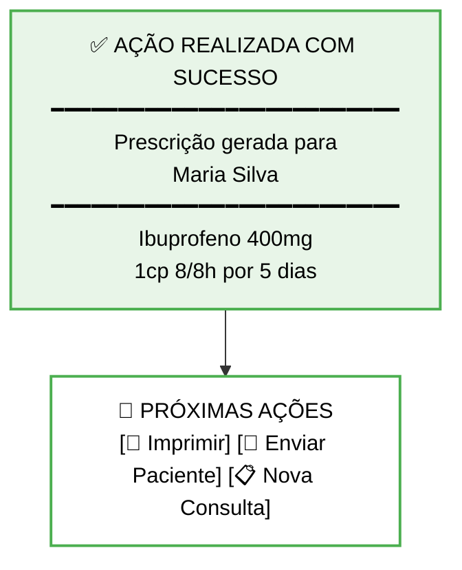

---

## 📱 Responsive Design - Adaptação Mobile

### **Layout Portrait (Vertical) - iPhone Padrão**

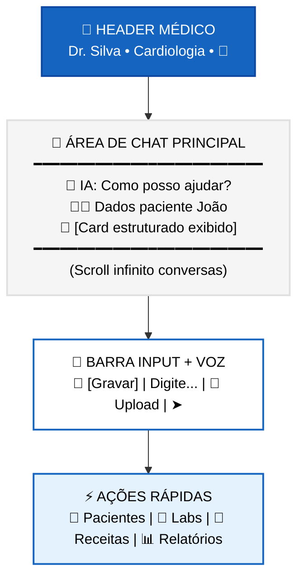

### **Layout Landscape (Horizontal) - Visão Expandida**

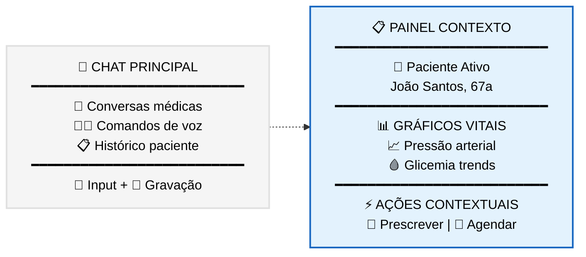

---

## 🎯 Microinterações

### **Feedback Tátil (Haptic)**
- **🎤 Início gravação**: Haptic leve
- **✅ Ação confirmada**: Haptic sucesso  
- **⚠️ Erro/Alerta**: Haptic erro
- **📱 Nova mensagem**: Haptic notificação

### **Animações Suaves**
- **💬 Chat bubbles**: Fade in bottom-up
- **📊 Cards**: Slide in left-right  
- **🎤 Recording**: Pulse animation
- **⚡ Loading**: Gentle breathing animation

---

## 🧪 Protótipo de Fluxo Completo

### **Cenário: Prescrição de Medicamento**

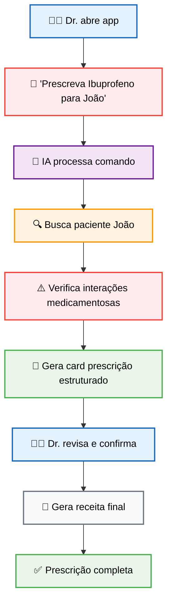

---

## 📐 Especificações Técnicas

### **Tipografia**
- **Heading**: SF Pro Display Semibold 18-24pt
- **Body**: SF Pro Text Regular 16pt  
- **Caption**: SF Pro Text Regular 14pt
- **Monospace**: SF Mono Regular 14pt (dados médicos)

### **Espaçamento**
- **Padding**: 16px (padrão)
- **Margins**: 8px, 16px, 24px
- **Chat bubbles**: 12px padding interno
- **Card radius**: 12px border-radius

### **Acessibilidade**
- **Contraste**: WCAG AA compliant
- **Font scaling**: Suporte Dynamic Type
- **Voice Over**: Labels descritivos
- **Gesture navigation**: Suporte completo

Esta especificação de design garante uma interface médica **familiar** (WhatsApp), **inteligente** (Gemini), e **focada** (memOS) para máxima eficiência no ambiente hospitalar. 