# 🎨 Design da Interface - Prontuário MVP

## 📱 Conceito de Design Híbrido

A interface do Prontuário combina os melhores elementos de três paradigmas de design em um fluxo de duas telas principais:

### **🔄 Fluxo de Navegação**

**Main Screen (WhatsApp)** → **Chat Screen (Gemini)** → **Conversa Ativa (Gemini + memOS)**

| **Tela** | **Inspiração** | **Elementos Adotados** | **Aplicação Médica** |
|----------|----------------|------------------------|----------------------|
| **🏠 Main Screen** | **💬 WhatsApp** | **Lista chats, search, filtros, tabs** | **Lista pacientes, busca IA, filtros departamento** |
| **💬 Chat Screen** | **🤖 Gemini** | **Interface limpa, "Hello", input minimalista** | **Conversa com IA médica, comandos por voz** |
| **📊 Conversa Ativa** | **🧠 memOS + Gemini** | **Respostas estruturadas, foco cognitivo** | **Dados médicos organizados, decisões clínicas** |

---

## 🎨 Paleta de Cores Unificada

### **Cores Primárias - Base Medical**

```
🔵 Azul Médico Principal: #1565C0  (Headers, comandos médico)
⚪ Branco Limpo: #FFFFFF          (Backgrounds principais)
🔷 Azul Claro: #E3F2FD           (Filtros, sugestões)
⚪ Cinza Claro: #F5F5F5          (Search bars, inputs)
📐 Cinza Borda: #E0E0E0          (Bordas consistentes)
```

### **Cores Funcionais - Estados Médicos**

```
🟣 Roxo IA: #F3E5F5/#6A1B9A     (Respostas estruturadas da IA)
🟢 Verde Sucesso: #E8F5E8/#4CAF50 (Ações, confirmações)
🟡 Amarelo Alerta: #FFF3E0/#FF9800 (Atenção médica)
🔴 Vermelho Crítico: #FFEBEE/#F44336 (Urgente, anormal)
```

### **Aplicação Consistente**

| **Elemento** | **Cor de Fundo** | **Cor de Borda** | **Texto** |
|--------------|-------------------|------------------|-----------|
| **Headers** | `#1565C0` | `#0D47A1` | Branco |
| **Backgrounds** | `#FFFFFF` | `#E0E0E0` | Preto |
| **Inputs/Search** | `#F5F5F5` | `#E0E0E0` | Preto |
| **Filtros** | `#E3F2FD` | `#1565C0` | Preto |
| **IA Responses** | `#F3E5F5` | `#6A1B9A` | Preto |
| **Actions** | `#E8F5E8` | `#4CAF50` | Preto |

---

## 📱 Wireframes das Telas Principais

### **1. Main Screen - Lista de Pacientes (Estilo WhatsApp)**

```mermaid
flowchart TD
    MainHeader["📱 HEADER PRINCIPAL<br/>Prontuário • Dr. Silva • 🔔 • ⚙️ • ➕"]
    
    SearchBar["🔍 BUSCA IA MÉDICA<br/>Ask Medical AI or Search Patient..."]
    
    FilterTabs["📋 FILTROS<br/>All | Urgent 2 | Today | ICU | ➕"]
    
    PatientList["👥 LISTA DE PACIENTES<br/>━━━━━━━━━━━━━━━━━━━━━━━━━━<br/>📂 Archived                    12<br/>━━━━━━━━━━━━━━━━━━━━━━━━━━<br/>👤 Maria Silva, 45a     Yesterday<br/>🩺 Diabetes: HbA1c alto. Consulta?<br/>━━━━━━━━━━━━━━━━━━━━━━━━━━<br/>👤 João Santos, 67a        18:24<br/>🫀 Cardiologia: Pressão controlada<br/>━━━━━━━━━━━━━━━━━━━━━━━━━━<br/>👤 Ana Costa, 32a          18:00<br/>🤰 Obs: Pré-natal de rotina OK<br/>━━━━━━━━━━━━━━━━━━━━━━━━━━<br/>👤 Pedro Lima, 55a         17:58<br/>🎤 Análise exames pendente..."]

    TabBar["📱 TAB BAR<br/>Updates | Calls | Teams | Chats | Settings"]

    MainHeader --> SearchBar
    SearchBar --> FilterTabs
    FilterTabs --> PatientList
    PatientList --> TabBar

    style MainHeader fill:#1565C0,stroke:#0D47A1,stroke-width:2px,color:#fff
    style SearchBar fill:#F5F5F5,stroke:#E0E0E0,stroke-width:2px,color:#000
    style FilterTabs fill:#E3F2FD,stroke:#1565C0,stroke-width:2px,color:#000
    style PatientList fill:#FFFFFF,stroke:#E0E0E0,stroke-width:2px,color:#000
    style TabBar fill:#F5F5F5,stroke:#E0E0E0,stroke-width:2px,color:#000
```

### **2. Chat Screen - Conversa com IA (Estilo Gemini)**

```mermaid
flowchart TD
    ChatHeader["📱 CHAT HEADER<br/>← Maria Silva, 45a • Diabetes"]
    
    WelcomeArea["🎯 ÁREA PRINCIPAL LIMPA<br/>━━━━━━━━━━━━━━━━━━━━━━━━━━<br/>                          <br/>     Hello, Dr. Silva      <br/>                          <br/>━━━━━━━━━━━━━━━━━━━━━━━━━━"]
    
    InputArea["🎤 ASK MEDICAL AI<br/>━━━━━━━━━━━━━━━━━━━━━━━━━━<br/>➕ | Video | Research | 🎤 | 📊"]
    
    QuickSuggestions["💡 SUGESTÕES RÁPIDAS<br/>I | The | Patient's"]

    ChatHeader --> WelcomeArea
    WelcomeArea --> InputArea
    InputArea --> QuickSuggestions

    style ChatHeader fill:#1565C0,stroke:#0D47A1,stroke-width:2px,color:#fff
    style WelcomeArea fill:#FFFFFF,stroke:#E0E0E0,stroke-width:2px,color:#1565C0
    style InputArea fill:#F5F5F5,stroke:#E0E0E0,stroke-width:2px,color:#000
    style QuickSuggestions fill:#E3F2FD,stroke:#1565C0,stroke-width:2px,color:#000
```

### **3. Conversa Ativa - Resposta Estruturada da IA**

```mermaid
flowchart TD
    UserQuery["👨‍⚕️ COMANDO DO MÉDICO<br/>━━━━━━━━━━━━━━━━━━━━━━━━━━<br/>Analise exames de Maria Silva<br/>                         ✓✓"]
    
    AIResponse["🤖 IA RESPOSTA ESTRUTURADA<br/>━━━━━━━━━━━━━━━━━━━━━━━━━━<br/>📊 ANÁLISE LABORATORIAL<br/>━━━━━━━━━━━━━━━━━━━━━━━━━━<br/>🔍 Glicemia: 180 mg/dL<br/>⚠️ Status: ELEVADA<br/>📈 Tendência: +15% (30 dias)<br/>━━━━━━━━━━━━━━━━━━━━━━━━━━<br/>💡 RECOMENDAÇÕES<br/>• Ajustar Metformina para 850mg<br/>• Reavaliar em 2 semanas<br/>• Orientar dieta restritiva<br/>━━━━━━━━━━━━━━━━━━━━━━━━━━<br/>📋 PRÓXIMOS PASSOS<br/>☐ Receita atualizada<br/>☐ Agendamento retorno<br/>☐ Orientação nutricional"]
    
    ActionButtons["🎯 AÇÕES CONTEXTUAIS<br/>[💊 Prescrever] [📅 Agendar] [📄 Imprimir] [🔄 Refinar]"]

    UserQuery --> AIResponse
    AIResponse --> ActionButtons

    style UserQuery fill:#1565C0,stroke:#0D47A1,stroke-width:2px,color:#fff
    style AIResponse fill:#F3E5F5,stroke:#6A1B9A,stroke-width:2px,color:#000
    style ActionButtons fill:#E8F5E8,stroke:#4CAF50,stroke-width:2px,color:#000
```


---

## 🗨️ Componentes de Interface

### **Chat Bubble do Médico - Estilo WhatsApp**

```mermaid
flowchart TD
    DoctorBubble["👨‍⚕️ MENSAGEM DO MÉDICO<br/>━━━━━━━━━━━━━━━━━━━━━━━━━━<br/>Dr. Silva • 14:32<br/>━━━━━━━━━━━━━━━━━━━━━━━━━━<br/>Prescreva Ibuprofeno 400mg<br/>para Maria Silva<br/>━━━━━━━━━━━━━━━━━━━━━━━━━━<br/>                    ✓✓ Lido"]

    style DoctorBubble fill:#1565C0,stroke:#0D47A1,stroke-width:2px,color:#fff
```

### **Chat Bubble da IA - Estilo Gemini Estruturado**

```mermaid
flowchart TD
    AIBubble["🤖 RESPOSTA IA MÉDICA<br/>━━━━━━━━━━━━━━━━━━━━━━━━━━<br/>IA Médica • 14:32<br/>━━━━━━━━━━━━━━━━━━━━━━━━━━<br/>💊 PRESCRIÇÃO GERADA<br/>━━━━━━━━━━━━━━━━━━━━━━━━━━<br/>Paciente: Maria Silva (45a)<br/>Medicamento: Ibuprofeno 400mg<br/>Posologia: 1cp 8/8h por 5 dias<br/>⚠️ Verificado: Sem interações<br/>━━━━━━━━━━━━━━━━━━━━━━━━━━<br/>[📄 Imprimir] [📧 Enviar] [✏️ Editar]"]

    style AIBubble fill:#F3E5F5,stroke:#6A1B9A,stroke-width:2px,color:#000
```

### **Card de Paciente - Dados Estruturados**

```mermaid
flowchart TD
    PatientCard["👤 DADOS DO PACIENTE<br/>━━━━━━━━━━━━━━━━━━━━━━━━━━<br/>Nome: Maria Silva<br/>Idade: 45 anos<br/>Sexo: Feminino<br/>Registro: #12345<br/>━━━━━━━━━━━━━━━━━━━━━━━━━━<br/>🏥 DEPARTAMENTO<br/>Endocrinologia - Sala 203<br/>Dr. Roberto Silva<br/>━━━━━━━━━━━━━━━━━━━━━━━━━━<br/>📅 ÚLTIMA CONSULTA<br/>15/01/2024 - Controle diabetes<br/>Próxima: 29/01/2024"]
    
    ActionPatient["🎯 AÇÕES RÁPIDAS<br/>[📋 Histórico] [📅 Agendar] [💊 Receitas]"]

    PatientCard --> ActionPatient

    style PatientCard fill:#FFFFFF,stroke:#E0E0E0,stroke-width:2px,color:#000
    style ActionPatient fill:#E8F5E8,stroke:#4CAF50,stroke-width:2px,color:#000
```

### **Card de Exames - Resultados com Status Visual**

```mermaid
flowchart TD
    LabCard["🔬 RESULTADOS LABORATORIAIS<br/>━━━━━━━━━━━━━━━━━━━━━━━━━━<br/>Data: 20/01/2024<br/>━━━━━━━━━━━━━━━━━━━━━━━━━━<br/>🩸 Glicemia em Jejum<br/>180 mg/dL ⚠️ ALTO (70-100)<br/>━━━━━━━━━━━━━━━━━━━━━━━━━━<br/>🧪 HbA1c<br/>7.2% ⚠️ ALTO (REF: <7.0)<br/>━━━━━━━━━━━━━━━━━━━━━━━━━━<br/>💉 Insulina<br/>15 mU/L ✅ NORMAL (2-20)"]
    
    LabAction["🎯 AÇÃO REQUERIDA<br/>Ajuste medicação + dieta restritiva<br/>[📈 Ver Tendência] [💊 Prescrever] [📄 Relatório]"]

    LabCard --> LabAction

    style LabCard fill:#FFFFFF,stroke:#E0E0E0,stroke-width:2px,color:#000
    style LabAction fill:#FFF3E0,stroke:#FF9800,stroke-width:2px,color:#000
```

---

## 🎤 Interação por Voz - Interface de Áudio

### **Estado de Gravação Ativa**

```mermaid
flowchart TD
    RecordingState["🎤 GRAVANDO ÁUDIO<br/>┌─────────────────────────┐<br/>│   🔴 REC  00:15         │<br/>│  ████████░░░░░░░░░░░    │<br/>│                         │<br/>│ 'Prescreva Metformina   │<br/>│  500mg para diabete...' │<br/>│                         │<br/>│   [⏹️ Parar] [🗑️ Cancelar] │<br/>└─────────────────────────┘"]
    
    ProcessingState["🤖 PROCESSANDO<br/>┌─────────────────────────┐<br/>│   🔄 Analisando...      │<br/>│  ●●●●●●●●●●●●●●●●●●●●    │<br/>│                         │<br/>│ Reconhecendo termos     │<br/>│ médicos e processando   │<br/>│ sua solicitação...      │<br/>└─────────────────────────┘"]
    
    ResponseState["✅ RESPOSTA GERADA<br/>┌─────────────────────────┐<br/>│ 🤖 Entendi sua solicit. │<br/>│                         │<br/>│ Prescrição Metformina:  │<br/>│ • 500mg 2x/dia          │<br/>│ • Com refeições         │<br/>│ • Controle em 30 dias   │<br/>│                         │<br/>│ [📄 Confirmar] [🔄 Refazer]│<br/>└─────────────────────────┘"]

    RecordingState --> ProcessingState
    ProcessingState --> ResponseState

    style RecordingState fill:#FFEBEE,stroke:#F44336,stroke-width:2px,color:#000
    style ProcessingState fill:#FFF3E0,stroke:#FF9800,stroke-width:2px,color:#000
    style ResponseState fill:#E8F5E8,stroke:#4CAF50,stroke-width:2px,color:#000
```

---

## 📊 Visualização de Dados Médicos

### **Gráfico de Tendência - Interface Limpa**

```mermaid
flowchart TD
    ChartHeader["📈 GLICEMIA - ÚLTIMOS 30 DIAS"]
    
    ChartArea["GRÁFICO INTERATIVO<br/>┌─────────────────────────────────┐<br/>│ 200mg/dL ┼                     │<br/>│          │     ●               │<br/>│ 150mg/dL ┼   ●   ●             │<br/>│          │ ●       ●           │<br/>│ 100mg/dL ┼●         ● ●       │<br/>│          │             ●       │<br/>│  50mg/dL ┼                     │<br/>│          └─────────────────────│<br/>│           Jan 1  Jan 15  Jan 30│<br/>└─────────────────────────────────┘<br/>🎯 Toque nos pontos para detalhes"]
    
    ChartInsights["💡 INSIGHTS IA<br/>• Tendência: Melhora gradual<br/>• Picos: Relacionados a stress<br/>• Meta: Manter < 130mg/dL"]

    ChartHeader --> ChartArea
    ChartArea --> ChartInsights

    style ChartHeader fill:#E3F2FD,stroke:#1565C0,stroke-width:2px,color:#000
    style ChartArea fill:#FFFFFF,stroke:#E0E0E0,stroke-width:2px,color:#000
    style ChartInsights fill:#F3E5F5,stroke:#6A1B9A,stroke-width:2px,color:#000
```

---

## 🔧 Estados de Interface

### **Estado de Loading - Interface Limpa**

```mermaid
flowchart TD
    LoadingState["🔄 CONSULTANDO IA<br/>━━━━━━━━━━━━━━━━━━━━━━━━━━<br/>●●●●●●●●●●●●●●●●●●●<br/>━━━━━━━━━━━━━━━━━━━━━━━━━━<br/>Analisando dados do<br/>paciente Maria Silva<br/>━━━━━━━━━━━━━━━━━━━━━━━━━━<br/>Processando solicitação...<br/>Por favor aguarde"]

    style LoadingState fill:#F5F5F5,stroke:#E0E0E0,stroke-width:2px,color:#000
```

### **Estado de Erro - Interface Amigável**

```mermaid
flowchart TD
    ErrorState["⚠️ OPS! ALGO DEU ERRADO<br/>━━━━━━━━━━━━━━━━━━━━━━━━━━<br/>Não consegui processar<br/>sua solicitação.<br/>━━━━━━━━━━━━━━━━━━━━━━━━━━<br/>Tente uma destas opções:"]
    
    ErrorActions["🎯 OPÇÕES DE RECUPERAÇÃO<br/>[🔄 Tentar Novamente] [🎤 Usar Voz] [💬 Chat Texto]"]

    ErrorState --> ErrorActions

    style ErrorState fill:#FFEBEE,stroke:#F44336,stroke-width:2px,color:#000
    style ErrorActions fill:#FFF3E0,stroke:#FF9800,stroke-width:2px,color:#000
```

### **Estado de Sucesso - Confirmação Visual**

```mermaid
flowchart TD
    SuccessState["✅ AÇÃO REALIZADA COM SUCESSO<br/>━━━━━━━━━━━━━━━━━━━━━━━━━━<br/>Prescrição gerada para<br/>Maria Silva<br/>━━━━━━━━━━━━━━━━━━━━━━━━━━<br/>Ibuprofeno 400mg<br/>1cp 8/8h por 5 dias"]
    
    SuccessActions["🎯 PRÓXIMAS AÇÕES<br/>[📄 Imprimir] [📧 Enviar Paciente] [📋 Nova Consulta]"]

    SuccessState --> SuccessActions

    style SuccessState fill:#E8F5E8,stroke:#4CAF50,stroke-width:2px,color:#000
    style SuccessActions fill:#FFFFFF,stroke:#E0E0E0,stroke-width:2px,color:#000
```

---

## 📱 Responsive Design - Adaptação Mobile

### **Layout Portrait (Vertical) - iPhone Padrão**

```mermaid
flowchart TD
    PortraitHeader["📱 HEADER MÉDICO<br/>Dr. Silva • Cardiologia • 🔔"]
    PortraitChat["💬 ÁREA DE CHAT PRINCIPAL<br/>━━━━━━━━━━━━━━━━━━━━━━━━━━<br/>🤖 IA: Como posso ajudar?<br/>👨‍⚕️ Dados paciente João<br/>🤖 [Card estruturado exibido]<br/>━━━━━━━━━━━━━━━━━━━━━━━━━━<br/>(Scroll infinito conversas)"]
    PortraitInput["📝 BARRA INPUT + VOZ<br/>🎤 [Gravar] | Digite... | 📁 Upload | ➤"]
    PortraitActions["⚡ AÇÕES RÁPIDAS<br/>👥 Pacientes | 🔬 Labs | 💊 Receitas | 📊 Relatórios"]

    PortraitHeader --> PortraitChat
    PortraitChat --> PortraitInput
    PortraitInput --> PortraitActions

    style PortraitHeader fill:#1565C0,stroke:#0D47A1,stroke-width:2px,color:#fff
    style PortraitChat fill:#FFFFFF,stroke:#E0E0E0,stroke-width:2px,color:#000
    style PortraitInput fill:#F5F5F5,stroke:#E0E0E0,stroke-width:2px,color:#000
    style PortraitActions fill:#E3F2FD,stroke:#1565C0,stroke-width:2px,color:#000
```

### **Layout Landscape (Horizontal) - Visão Expandida**

```mermaid
flowchart LR
    LandscapeLeft["💬 CHAT PRINCIPAL<br/>━━━━━━━━━━━━━━━━━━━━━━━━━━<br/>🤖 Conversas médicas<br/>👨‍⚕️ Comandos de voz<br/>📋 Histórico paciente<br/>━━━━━━━━━━━━━━━━━━━━━━━━━━<br/>📝 Input + 🎤 Gravação"]
    
    LandscapeRight["📋 PAINEL CONTEXTO<br/>━━━━━━━━━━━━━━━━━━━━━━━━━━<br/>👤 Paciente Ativo<br/>João Santos, 67a<br/>━━━━━━━━━━━━━━━━━━━━━━━━━━<br/>📊 GRÁFICOS VITAIS<br/>📈 Pressão arterial<br/>🩸 Glicemia trends<br/>━━━━━━━━━━━━━━━━━━━━━━━━━━<br/>⚡ AÇÕES CONTEXTUAIS<br/>💊 Prescrever | 📅 Agendar"]

    LandscapeLeft -.-> LandscapeRight

    style LandscapeLeft fill:#FFFFFF,stroke:#E0E0E0,stroke-width:2px,color:#000
    style LandscapeRight fill:#E3F2FD,stroke:#1565C0,stroke-width:2px,color:#000
```

---

## 🎯 Microinterações

### **Feedback Tátil (Haptic)**
- **🎤 Início gravação**: Haptic leve
- **✅ Ação confirmada**: Haptic sucesso  
- **⚠️ Erro/Alerta**: Haptic erro
- **📱 Nova mensagem**: Haptic notificação

### **Animações Suaves**
- **💬 Chat bubbles**: Fade in bottom-up
- **📊 Cards**: Slide in left-right  
- **🎤 Recording**: Pulse animation
- **⚡ Loading**: Gentle breathing animation

---

## 🧪 Protótipo de Fluxo Completo

### **Cenário: Prescrição de Medicamento**

```mermaid
flowchart TD
    Start["👨‍⚕️ Dr. abre app"] 
    --> VoiceInput["🎤 'Prescreva Ibuprofeno para João'"]
    --> Processing["🤖 IA processa comando"]
    --> PatientSearch["🔍 Busca paciente João"]
    --> SafetyCheck["⚠️ Verifica interações medicamentosas"]
    --> PrescriptionCard["💊 Gera card prescrição estruturado"]
    --> Review["👨‍⚕️ Dr. revisa e confirma"]
    --> Generate["📄 Gera receita final"]
    --> Complete["✅ Prescrição completa"]

    style Start fill:#E3F2FD,stroke:#1565C0,stroke-width:2px,color:#000
    style VoiceInput fill:#FFEBEE,stroke:#F44336,stroke-width:2px,color:#000
    style Processing fill:#F3E5F5,stroke:#6A1B9A,stroke-width:2px,color:#000
    style PatientSearch fill:#FFF3E0,stroke:#FF9800,stroke-width:2px,color:#000
    style SafetyCheck fill:#FFEBEE,stroke:#F44336,stroke-width:2px,color:#000
    style PrescriptionCard fill:#E8F5E8,stroke:#4CAF50,stroke-width:2px,color:#000
    style Review fill:#E3F2FD,stroke:#1565C0,stroke-width:2px,color:#000
    style Generate fill:#F8F9FA,stroke:#6C757D,stroke-width:2px,color:#000
    style Complete fill:#E8F5E8,stroke:#4CAF50,stroke-width:2px,color:#000
```

---

## 📐 Especificações Técnicas

### **Tipografia**
- **Heading**: SF Pro Display Semibold 18-24pt
- **Body**: SF Pro Text Regular 16pt  
- **Caption**: SF Pro Text Regular 14pt
- **Monospace**: SF Mono Regular 14pt (dados médicos)

### **Espaçamento**
- **Padding**: 16px (padrão)
- **Margins**: 8px, 16px, 24px
- **Chat bubbles**: 12px padding interno
- **Card radius**: 12px border-radius

### **Acessibilidade**
- **Contraste**: WCAG AA compliant
- **Font scaling**: Suporte Dynamic Type
- **Voice Over**: Labels descritivos
- **Gesture navigation**: Suporte completo

Esta especificação de design garante uma interface médica **familiar** (WhatsApp), **inteligente** (Gemini), e **focada** (memOS) para máxima eficiência no ambiente hospitalar. 