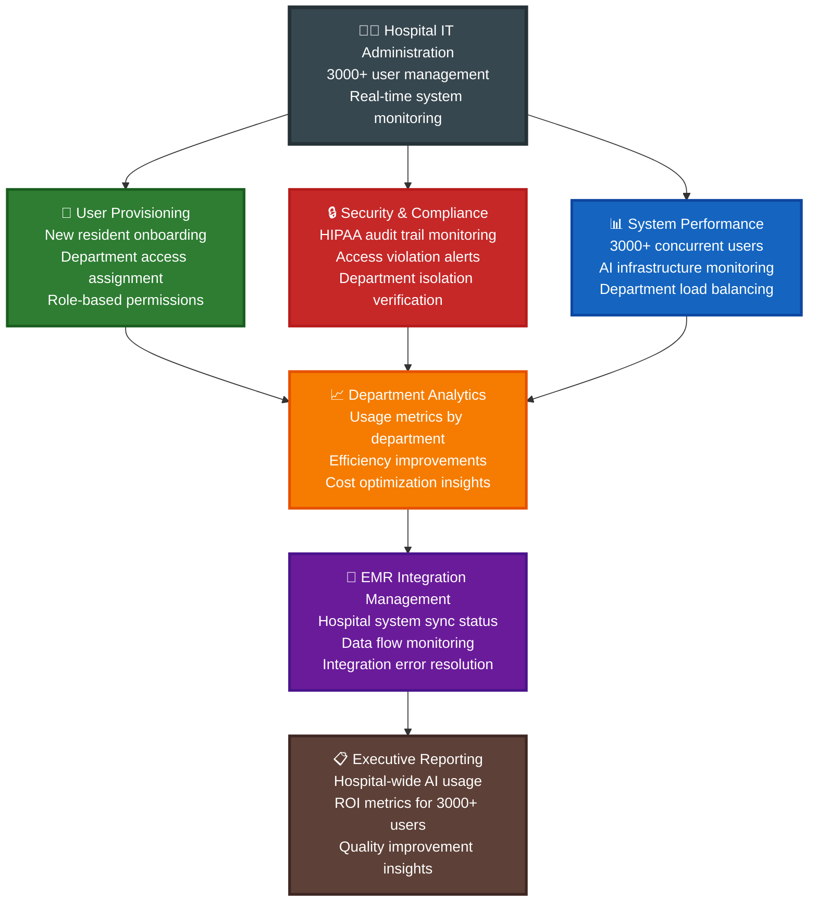

# Prontuário Platform - Enterprise Hospital Implementation for 3000+ Doctors

## 🏥 Hospital-Scale Use Cases & Department Workflows

This document outlines comprehensive enterprise use cases for the Prontuário medical platform, focusing on hospital-wide functionality that serves large institutions like Hospital Real Português with 3000+ healthcare professionals across multiple departments and specialties.

---

## 🏥 Use Case 1: Multi-Department Morning Rounds Coordination

### Context: Hospital Real Português - 7:00 AM Hospital-Wide Rounds
### Scale: 300+ doctors across 15 departments starting morning rounds simultaneously

- **Cardiology Department**: 25 doctors reviewing 180 cardiac patients
- **Emergency Medicine**: 15 doctors managing 45 emergency cases  
- **Surgery Department**: 20 surgeons reviewing 80 pre/post-op patients
- **ICU Units**: 12 intensivists managing 36 critical care patients

### Enterprise Workflow

```mermaid
flowchart TD
    HospitalStart[🏥 7:00 AM Hospital-Wide Rounds<br/>300+ doctors logging in simultaneously<br/>Hospital Real Português]

    %% Enterprise Authentication
    EnterpriseSSO[🔐 Hospital SSO Login<br/>Active Directory integration<br/>Badge authentication for 300+ users]
    
    %% Department Routing
    DeptSelection[🏢 Department Selection<br/>Cardiology | Emergency | Surgery | ICU<br/>Role-based department access]
    
    %% Department-Specific Workflows
    CardiologyFlow[❤️ Cardiology Department<br/>25 doctors accessing 180 patients<br/>Specialized cardiac protocols]
    EmergencyFlow[🚨 Emergency Department<br/>15 doctors managing 45 cases<br/>Triage-based prioritization]
    SurgeryFlow[🔪 Surgery Department<br/>20 surgeons reviewing 80 cases<br/>Pre/post-op specialized workflows]
    ICUFlow[🏥 ICU Department<br/>12 intensivists managing 36 patients<br/>Critical care monitoring]
    
    %% Cross-Department Intelligence
    HospitalAI[🤖 Hospital-Wide AI Intelligence<br/>Shared patient insights across departments<br/>EMR integration for 3000+ staff]
    
    %% Department Coordination
    CrossDeptAlert[🔔 Cross-Department Alerts<br/>Cardiology ↔ Surgery coordination<br/>ICU ↔ Emergency handoffs]
    
    %% Administrative Oversight
    AdminDashboard[📊 Hospital Administration<br/>Real-time department metrics<br/>Resource allocation insights]

    %% Flow connections
    HospitalStart --> EnterpriseSSO
    EnterpriseSSO --> DeptSelection
    DeptSelection --> CardiologyFlow
    DeptSelection --> EmergencyFlow
    DeptSelection --> SurgeryFlow
    DeptSelection --> ICUFlow
    
    CardiologyFlow --> HospitalAI
    EmergencyFlow --> HospitalAI
    SurgeryFlow --> HospitalAI
    ICUFlow --> HospitalAI
    
    HospitalAI --> CrossDeptAlert
    CrossDeptAlert --> AdminDashboard

    %% Styling for enterprise scale
    style HospitalStart fill:#1565C0,stroke:#0D47A1,stroke-width:4px,color:#fff
    style EnterpriseSSO fill:#2E7D32,stroke:#1B5E20,stroke-width:3px,color:#fff
    style DeptSelection fill:#E65100,stroke:#BF360C,stroke-width:3px,color:#fff
    style CardiologyFlow fill:#C62828,stroke:#B71C1C,stroke-width:3px,color:#fff
    style EmergencyFlow fill:#AD1457,stroke:#880E4F,stroke-width:3px,color:#fff
    style SurgeryFlow fill:#6A1B9A,stroke:#4A148C,stroke-width:3px,color:#fff
    style ICUFlow fill:#1565C0,stroke:#0D47A1,stroke-width:3px,color:#fff
    style HospitalAI fill:#00695C,stroke:#004D40,stroke-width:4px,color:#fff
    style CrossDeptAlert fill:#F57C00,stroke:#E65100,stroke-width:3px,color:#fff
    style AdminDashboard fill:#5D4037,stroke:#3E2723,stroke-width:3px,color:#fff
```

### Enterprise Benefits

- **🏥 Hospital-Scale Efficiency**: 300+ doctors starting rounds simultaneously
- **🔄 Department Coordination**: Real-time cross-department communication
- **📊 Administrative Oversight**: Hospital-wide metrics and resource management
- **🤖 Shared Intelligence**: AI insights accessible across all departments

---

## 🚨 Use Case 2: Emergency Department Integration with Hospital-Wide Systems

### Context: Emergency Medicine Department - 24/7 Operations
### Scale: 45 emergency physicians, 80 nurses, 15,000+ annual emergency visits

- **Integration Challenge**: Emergency cases requiring immediate hospital-wide coordination
- **EMR Integration**: Real-time sync with existing hospital electronic medical records
- **Cross-Department Alerts**: ICU, Surgery, Cardiology coordination for critical cases

### Enterprise Emergency Workflow

```mermaid
flowchart TD
    EmergencyAdmission[🚨 Emergency Patient Admission<br/>Trauma Bay 3 - Cardiac Emergency<br/>EMR Auto-Integration]

    %% Enterprise EMR Integration
    EMRSync[📋 Hospital EMR Integration<br/>Existing patient records loaded<br/>Insurance & medical history sync]
    
    %% Department Notifications
    AutoAlert[🔔 Automatic Department Alerts<br/>Cardiology: Dr. Santos notified<br/>ICU: Bed 12 reserved<br/>Surgery: OR 3 on standby]
    
    %% Multi-Department Coordination
    CardiologyConsult[❤️ Cardiology Consultation<br/>Dr. Santos reviews from office<br/>Voice AI: "Patient needs immediate cath"]
    ICUPrep[🏥 ICU Preparation<br/>Bed 12 prepared for post-procedure<br/>Ventilator and monitoring ready]
    SurgeryStandby[🔪 Surgery Department<br/>OR 3 on standby<br/>Surgical team notified]
    
    %% Hospital-Wide Intelligence
    HospitalProtocol[🤖 Hospital Protocol AI<br/>STEMI protocol activated<br/>Evidence-based care pathways<br/>Hospital formulary drug checking]
    
    %% Documentation
    RealTimeDoc[📝 Real-Time Documentation<br/>Multi-department notes synchronized<br/>Voice documentation across all departments]
    
    %% Administrative Tracking
    AdminTracking[📊 Hospital Administration<br/>Resource utilization tracking<br/>Department coordination metrics<br/>Quality assurance monitoring]

    %% Flow connections
    EmergencyAdmission --> EMRSync
    EMRSync --> AutoAlert
    AutoAlert --> CardiologyConsult
    AutoAlert --> ICUPrep
    AutoAlert --> SurgeryStandby
    
    CardiologyConsult --> HospitalProtocol
    ICUPrep --> HospitalProtocol
    SurgeryStandby --> HospitalProtocol
    
    HospitalProtocol --> RealTimeDoc
    RealTimeDoc --> AdminTracking

    %% Styling for emergency coordination
    style EmergencyAdmission fill:#C62828,stroke:#B71C1C,stroke-width:4px,color:#fff
    style EMRSync fill:#2E7D32,stroke:#1B5E20,stroke-width:3px,color:#fff
    style AutoAlert fill:#F57C00,stroke:#E65100,stroke-width:3px,color:#fff
    style CardiologyConsult fill:#AD1457,stroke:#880E4F,stroke-width:3px,color:#fff
    style ICUPrep fill:#1565C0,stroke:#0D47A1,stroke-width:3px,color:#fff
    style SurgeryStandby fill:#6A1B9A,stroke:#4A148C,stroke-width:3px,color:#fff
    style HospitalProtocol fill:#00695C,stroke:#004D40,stroke-width:4px,color:#fff
    style RealTimeDoc fill:#5D4037,stroke:#3E2723,stroke-width:3px,color:#fff
    style AdminTracking fill:#37474F,stroke:#263238,stroke-width:3px,color:#fff
```

### Emergency Department Integration Benefits

- **🚨 Instant Coordination**: Automatic department notifications for critical cases
- **📋 EMR Continuity**: Seamless integration with existing hospital records
- **🤖 Protocol Intelligence**: Hospital-specific care pathways and drug formularies
- **📊 Quality Tracking**: Administrative oversight of emergency care coordination

---

## 🏢 Use Case 3: Hospital Administration & IT Management

### Context: Hospital IT Department - User Management for 3000+ Staff
### Scale: Managing user access, security, and system performance across entire hospital

- **User Management**: 3000+ doctors, nurses, and staff across 20+ departments
- **Security Compliance**: HIPAA audit trails, department access controls
- **System Performance**: Monitoring AI infrastructure for hospital-wide usage

### Enterprise Administration Workflow



### Hospital Administration Benefits

- **👥 Enterprise User Management**: 3000+ staff across 20+ departments
- **🔒 Compliance Automation**: HIPAA audit trails and security monitoring
- **📊 Hospital-Wide Analytics**: Department performance and ROI tracking
- **🔄 Integration Oversight**: EMR sync management and error resolution

---

## 🎯 Enterprise Integration Patterns for 3000+ Users

### 1. Hospital-Scale Authentication

- **Enterprise SSO**: Active Directory integration for 3000+ users
- **Badge Integration**: Hospital ID badge authentication
- **Role-Based Access**: Attending physicians, residents, nurses, administrators
- **Department Isolation**: Secure multi-tenant architecture

### 2. EMR System Integration

- **Bidirectional Sync**: Real-time data exchange with existing hospital EMR
- **Legacy System Support**: Integration with older hospital information systems
- **Data Governance**: Hospital-wide patient data management policies
- **Audit Compliance**: Complete audit trails for regulatory requirements

### 3. Department-Specific Workflows

- **Cardiology**: Specialized cardiac protocols and monitoring
- **Emergency Medicine**: Triage-based prioritization and critical alerts
- **Surgery**: Pre/post-operative workflow optimization
- **ICU**: Critical care monitoring and ventilator integration

### 4. Hospital-Wide Intelligence

- **Cross-Department Coordination**: Real-time communication between departments
- **Protocol Automation**: Hospital-specific care pathways and guidelines
- **Resource Optimization**: Bed management, OR scheduling, equipment allocation
- **Quality Metrics**: Hospital-wide performance and outcome tracking

---

This enterprise documentation focuses on hospital-scale workflows and infrastructure requirements that demonstrate immediate value to large healthcare institutions with 3000+ medical professionals.

## 📋 **Next Steps for Hospital Implementation**

For comprehensive technical architecture, EMR integration specifications, enterprise security requirements, and hospital-scale infrastructure details, see **[ARCHITECTURE.md](./ARCHITECTURE.md)**. 

The ARCHITECTURE.md file contains enterprise-specific information for large hospital deployments including infrastructure scaling, security compliance, and integration strategies.

🏥