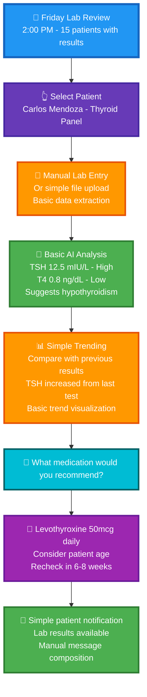
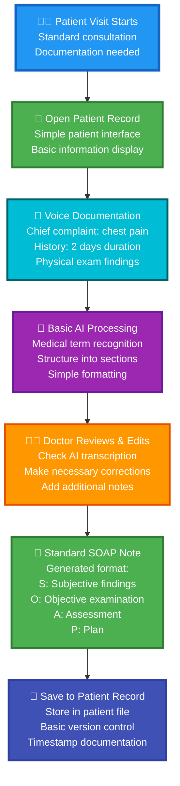

# Prontuário Platform - Complete Medical Solution & Implementation Guide

## 👩‍⚕️ Doctor Personas & Basic Workflows

This document outlines comprehensive use cases for the Prontuário medical platform, focusing on complete functionality that serves healthcare professionals from individual doctors to large health systems.

---

## 🏥 Use Case 1: Morning Hospital Rounds

### Persona: Dr. Maria Santos - Cardiologist

- **Experience**: 15 years in cardiology
- **Context**: Morning rounds at Hospital São Paulo
- **Challenge**: Reviewing 12 patients efficiently with latest updates

### Scenario Flow

```mermaid
flowchart TD
    Start[👩‍⚕️ Dr. Maria starts rounds<br/>7:00 AM - Cardiology Ward]

    %% Authentication and Navigation
    Login[🔑 Username/Password Login<br/>Secure authentication<br/>Hospital WiFi connection]
    PatientList[📋 Patient List View<br/>12 cardiology patients<br/>Sorted by priority alerts]
    PatientSelect[👆 Tap on João Silva<br/>Room 301 - High Priority]

    %% Chat Interface
    ChatOpen[💬 Chat Interface Opens<br/>Previous searches loaded<br/>Recent vitals displayed]
    VoiceQuery[🎤 Voice Input<br/>What happened with João overnight?]
    AIResponse[🤖 AI Response<br/>BP spiked to 180/100 at 3 AM<br/>Nurse administered Captopril<br/>Current 145/90, stable]

    %% Follow-up Queries
    FollowUp[🎤 Show me trending over 48h]
    TrendChart[📊 Blood Pressure Trend Chart<br/>Interactive 48-hour view<br/>Medication correlation]

    NextQuery[🎤 Any drug interactions?]
    DrugCheck[💊 Drug Interaction Analysis<br/>No conflicts detected<br/>Current medications compatible]

    %% Completion
    QuickNote[📝 Quick Note Addition<br/>Stable overnight, continue monitoring]
    NextPatient[➡️ Swipe to next patient<br/>Efficient workflow]

    %% Flow connections
    Start --> Login
    Login --> PatientList
    PatientList --> PatientSelect
    PatientSelect --> ChatOpen
    ChatOpen --> VoiceQuery
    VoiceQuery --> AIResponse
    AIResponse --> FollowUp
    FollowUp --> TrendChart
    TrendChart --> NextQuery
    NextQuery --> DrugCheck
    DrugCheck --> QuickNote
    QuickNote --> NextPatient

    %% Styling
    style Start fill:#2196F3,stroke:#1565C0,stroke-width:4px,color:#fff
    style Login fill:#4CAF50,stroke:#2E7D32,stroke-width:3px,color:#fff
    style PatientList fill:#4CAF50,stroke:#2E7D32,stroke-width:3px,color:#fff
    style PatientSelect fill:#FF9800,stroke:#E65100,stroke-width:3px,color:#fff
    style ChatOpen fill:#9C27B0,stroke:#6A1B9A,stroke-width:3px,color:#fff
    style VoiceQuery fill:#00BCD4,stroke:#006064,stroke-width:3px,color:#fff
    style AIResponse fill:#00BCD4,stroke:#0097A7,stroke-width:3px,color:#fff
    style FollowUp fill:#00BCD4,stroke:#006064,stroke-width:3px,color:#fff
    style TrendChart fill:#FF9800,stroke:#E65100,stroke-width:3px,color:#fff
    style NextQuery fill:#00BCD4,stroke:#006064,stroke-width:3px,color:#fff
    style DrugCheck fill:#9C27B0,stroke:#6A1B9A,stroke-width:3px,color:#fff
    style QuickNote fill:#4CAF50,stroke:#2E7D32,stroke-width:3px,color:#fff
    style NextPatient fill:#673AB7,stroke:#4527A0,stroke-width:3px,color:#fff
```

### Key Benefits

- **⏱️ Time Efficiency**: 3 minutes per patient vs 8 minutes traditional
- **🎤 Hands-Free**: Voice queries while examining patient
- **📊 Instant Insights**: Medical decision support with overnight summary
- **🔄 Continuity**: Previous conversations preserved

---

## 📋 Use Case 2: Basic Outpatient Consultation

### Persona: Dr. Ana Oliveira - Internal Medicine

- **Experience**: 12 years family medicine
- **Context**: Regular consultation, follow-up appointment
- **Challenge**: Comprehensive patient review with limited time

### Basic App Interaction Flow

```mermaid
flowchart TD
    Appointment[📅 9:00 AM Appointment<br/>Maria Santos - Diabetes Follow-up]

    %% Pre-Consultation Prep
    PatientTap[👆 Tap Patient Maria Santos<br/>Basic chat interface opens]

    %% Quick Prep Queries
    RecentLabs[🎤 Show recent lab results]
    LabResponse[🤖 HbA1c 7.2% last month<br/>Glucose 145 mg/dL fasting<br/>Target under 7.0% - needs improvement]

    MedicationCheck[🎤 Current medications?]
    MedResponse[💊 Metformin 1000mg BID<br/>Glipizide 10mg daily<br/>Last refill 2 weeks ago]

    %% During Consultation
    PatientArrives[👩 Patient Arrives<br/>Current complaints discussion]

    %% Simple Documentation
    SymptomEntry[🎤 Patient reports dizziness<br/>especially in mornings<br/>3 episodes this week]
    VitalSigns[📝 Current Vitals<br/>BP 130/85, HR 78<br/>Weight 68kg minus 2kg from last visit]

    BasicRecommendation[🎤 Suggest medication adjustment<br/>for better glucose control]
    SimpleResponse[🤖 Consider reducing Glipizide to 5mg<br/>Schedule follow-up in 2 weeks]

    %% Basic Documentation
    SimpleNote[📝 Basic Visit Note<br/>Manual entry with AI assistance<br/>Standard medical format]
    BasicPrescription[💊 Simple E-prescription<br/>Glipizide 5mg daily<br/>Manual pharmacy selection]

    %% Flow connections
    Appointment --> PatientTap
    PatientTap --> RecentLabs
    RecentLabs --> LabResponse
    LabResponse --> MedicationCheck
    MedicationCheck --> MedResponse

    MedResponse --> PatientArrives
    PatientArrives --> SymptomEntry
    SymptomEntry --> VitalSigns
    VitalSigns --> BasicRecommendation
    BasicRecommendation --> SimpleResponse

    SimpleResponse --> SimpleNote
    SimpleNote --> BasicPrescription

    %% Styling
    style Appointment fill:#2196F3,stroke:#1565C0,stroke-width:4px,color:#fff
    style PatientTap fill:#4CAF50,stroke:#2E7D32,stroke-width:3px,color:#fff
    style RecentLabs fill:#00BCD4,stroke:#006064,stroke-width:3px,color:#fff
    style LabResponse fill:#FF9800,stroke:#E65100,stroke-width:3px,color:#fff
    style MedicationCheck fill:#00BCD4,stroke:#006064,stroke-width:3px,color:#fff
    style MedResponse fill:#9C27B0,stroke:#6A1B9A,stroke-width:3px,color:#fff
    style PatientArrives fill:#673AB7,stroke:#4527A0,stroke-width:3px,color:#fff
    style SymptomEntry fill:#FF5722,stroke:#D84315,stroke-width:3px,color:#fff
    style VitalSigns fill:#795548,stroke:#5D4037,stroke-width:3px,color:#fff
    style BasicRecommendation fill:#00BCD4,stroke:#006064,stroke-width:3px,color:#fff
    style SimpleResponse fill:#9C27B0,stroke:#6A1B9A,stroke-width:3px,color:#fff
    style SimpleNote fill:#4CAF50,stroke:#2E7D32,stroke-width:3px,color:#fff
    style BasicPrescription fill:#9C27B0,stroke:#6A1B9A,stroke-width:3px,color:#fff
```

### Consultation Efficiency Gains

- **📊 Pre-visit Prep**: 2 minutes vs 10 minutes chart review
- **🎤 Voice Documentation**: Real-time note-taking while talking
- **🤖 Basic Medical Assistance**: Simple treatment suggestions
- **📝 Streamlined Notes**: Structured documentation support

---

## 🔬 Use Case 3: Simple Lab Results Review

### Persona: Dr. Roberto Silva - Endocrinologist

- **Experience**: 20 years, specializes in diabetes and hormonal disorders
- **Context**: Weekly lab results review session
- **Challenge**: Analyzing lab panels efficiently

### Basic Lab Review Workflow

### Basic Lab Features

- **📄 Simple Entry**: Manual input or basic file upload
- **📊 Basic Trends**: Simple historical comparison
- **⚠️ Flag Values**: Highlight abnormal results
- **💊 Basic Guidance**: Simple treatment suggestions
- **💊 Drug Lookup**: Basic medication information and interactions

---

## 📱 Use Case 4: Basic Patient Documentation

### Persona: Dr. Patricia Lima - General Practitioner

- **Experience**: 10 years in general medicine
- **Context**: Standard patient visits and documentation
- **Challenge**: Efficient documentation without complexity

### Basic Documentation Flow

### Documentation Benefits

- **🎤 Voice Input**: Hands-free documentation
- **🤖 AI Processing**: Basic medical term recognition
- **📝 Standard Format**: SOAP note generation
- **💾 Simple Storage**: Basic record management

---

## 🎯 Key MVP Interaction Patterns

### 1. Simple Voice-First Workflow

- **Primary Input**: Basic voice commands and queries
- **Secondary**: Touch for navigation
- **Benefit**: Reduced typing during patient care

### 2. Basic AI Assistance

- **Pattern**: Doctor asks simple questions about patient
- **Response**: AI provides straightforward, factual answers
- **Focus**: Information retrieval, not complex analysis

### 3. Streamlined Documentation

- **Overview**: Essential patient information first
- **Process**: Voice documentation with AI formatting
- **Output**: Standard medical note formats

### 4. Simple Integration

- **Entry Point**: Patient list or search
- **Process**: Basic documentation and review
- **Exit**: Save notes and basic care plans

---

## 💡 **MVP Value Propositions**

### Core Benefits

- **🤖 Basic Medical Chat**: Simple conversational interface for patient data
- **📱 Mobile-First**: iOS app with username/password authentication
- **🎤 Voice Documentation**: Hands-free note-taking with medical term recognition
- **📄 Standard Notes**: SOAP format generation from voice input
- **📊 Simple Analytics**: Basic vital sign and lab result trending
- **💊 Drug Lookup**: Basic medication information and interaction checking
- **📁 Document Vault**: PDF document upload and organization

### Technical Simplicity

- **Standard Authentication**: Username/password (no biometrics)
- **Google Medical AI**: Gemma3n + MedGemma for conversational medical queries
- **Local AI Processing**: Cost-effective DGX/Mac Mini/Mac Studio options
- **Simple Integration**: Basic EMR connectivity

---

This MVP documentation focuses on essential medical record functionality that provides immediate value to healthcare professionals while maintaining simplicity for rapid development and deployment.

## 📋 **Next Steps**

For comprehensive technical implementation details, architecture diagrams, development roadmaps, and component specifications, see **[DETAILS.md](./DETAILS.md)**. 

The DETAILS.md file contains:
- 🏗️ Complete platform architecture
- 🚀 12-month development strategy  
- 📱 Technical implementation guides
- 💰 Cost analysis in Brazilian Reais
- 🔧 Hardware setup instructions
- 📊 Network requirements and routing strategies

🚀