# Prontuário - Enterprise Medical AI Platform for Large Hospitals

## 🏥 Executive Summary

Prontuário is an enterprise-grade medical AI platform designed for large hospitals with 1000+ healthcare professionals. Built specifically for institutions like Hospital Real Português, the platform provides conversational AI interfaces that integrate seamlessly with existing hospital EMR systems, enabling 3000+ doctors to efficiently manage patient data with voice-powered insights across multiple departments and specialties.

---

## 🎯 Core Value Propositions

### 🤖 Enterprise Medical AI

- **Natural Conversations**: Conversational AI interface for patient data across all departments [MVP]
- **Voice Documentation**: Hospital-wide hands-free documentation during patient care [MVP]
- **Department Intelligence**: Specialized AI insights for Cardiology, Surgery, ICU, Emergency Medicine [MVP]
- **Drug Interaction System**: Hospital formulary integration with comprehensive drug checking [MVP]
- **Clinical Decision Support**: Evidence-based recommendations with hospital protocol integration
- **Hospital-Wide Alerts**: Real-time notifications for critical values and urgent cases

### 🏢 Enterprise Hospital Infrastructure

- **Multi-Department Support**: Seamless workflow across 20+ hospital departments
- **Role-Based Access**: Attending physicians, residents, nurses, and administrators
- **EMR Integration**: Bidirectional sync with existing hospital electronic medical records

### 🔒 Hospital-Grade Security & Compliance

- **Simple Authentication**: Username and password login for MVP
- **Department Isolation**: Secure multi-tenant architecture for different hospital units
- **Audit Compliance**: Complete audit trails for regulatory requirements
- **Local Data Processing**: On-premise AI processing for maximum patient data security

---

## 🚀 Key Benefits for Large Hospitals

| Benefit | Description | Enterprise Impact |
|---------|-------------|------------------|
| **⏱️ Hospital-Wide Efficiency** | Voice AI across all 3000+ doctors and departments | 40% faster documentation hospital-wide |
| **🔒 Enterprise Security** | Local AI processing with hospital-grade data protection | Complete patient data sovereignty |
| **📊 Clinical Intelligence** | AI insights across departments with hospital analytics | Improved care coordination and outcomes |
| **🏢 EMR Integration** | Seamless integration with existing hospital systems | Zero workflow disruption for medical staff |
| **💰 Cost Advantage** | Local AI infrastructure vs cloud AI for 3000 users | 90% cost reduction vs cloud AI solutions |

---

# 🏥 Hospital-Scale Use Cases & Department Workflows

This section outlines comprehensive enterprise use cases for the Prontuário medical platform, focusing on hospital-wide functionality that serves large institutions like Hospital Real Português with 3000+ healthcare professionals across multiple departments and specialties.

---

## 🏥 Use Case 1: Multi-Department Morning Rounds Coordination

### Context: Hospital Real Português - 7:00 AM Hospital-Wide Rounds
### Scale: 300+ doctors across 15 departments starting morning rounds simultaneously

- **Cardiology Department**: 25 doctors reviewing 180 cardiac patients
- **Emergency Medicine**: 15 doctors managing 45 emergency cases  
- **Surgery Department**: 20 surgeons reviewing 80 pre/post-op patients
- **ICU Units**: 12 intensivists managing 36 critical care patients

### Enterprise Workflow

```mermaid
flowchart TD
    HospitalStart[🏥 7:00 AM Hospital-Wide Rounds<br/>300+ doctors logging in simultaneously<br/>Hospital Real Português]

    %% Simple Authentication
    SimpleLogin[🔐 Simple Login<br/>Username and password<br/>Basic user authentication]
    
    %% Department Routing
    DeptSelection[🏢 Department Selection<br/>Cardiology | Emergency | Surgery | ICU<br/>Role-based department access]
    
    %% Department-Specific Workflows
    CardiologyFlow[❤️ Cardiology Department<br/>25 doctors accessing 180 patients<br/>Specialized cardiac protocols]
    EmergencyFlow[🚨 Emergency Department<br/>15 doctors managing 45 cases<br/>Triage-based prioritization]
    SurgeryFlow[🔪 Surgery Department<br/>20 surgeons reviewing 80 cases<br/>Pre/post-op specialized workflows]
    ICUFlow[🏥 ICU Department<br/>12 intensivists managing 36 patients<br/>Critical care monitoring]
    
    %% Cross-Department Intelligence
    HospitalAI[🤖 Hospital-Wide AI Intelligence<br/>Shared patient insights across departments<br/>EMR integration for 3000+ staff]
    
    %% Department Coordination
    CrossDeptAlert[🔔 Cross-Department Alerts<br/>Cardiology ↔ Surgery coordination<br/>ICU ↔ Emergency handoffs]
    
    %% Administrative Oversight
    AdminDashboard[📊 Hospital Administration<br/>Real-time department metrics<br/>Resource allocation insights]

    %% Flow connections
    HospitalStart --> SimpleLogin
    SimpleLogin --> DeptSelection
    DeptSelection --> CardiologyFlow
    DeptSelection --> EmergencyFlow
    DeptSelection --> SurgeryFlow
    DeptSelection --> ICUFlow
    
    CardiologyFlow --> HospitalAI
    EmergencyFlow --> HospitalAI
    SurgeryFlow --> HospitalAI
    ICUFlow --> HospitalAI
    
    HospitalAI --> CrossDeptAlert
    CrossDeptAlert --> AdminDashboard

    %% Styling for enterprise scale
    style HospitalStart fill:#1565C0,stroke:#0D47A1,stroke-width:4px,color:#fff
    style SimpleLogin fill:#2E7D32,stroke:#1B5E20,stroke-width:3px,color:#fff
    style DeptSelection fill:#E65100,stroke:#BF360C,stroke-width:3px,color:#fff
    style CardiologyFlow fill:#C62828,stroke:#B71C1C,stroke-width:3px,color:#fff
    style EmergencyFlow fill:#AD1457,stroke:#880E4F,stroke-width:3px,color:#fff
    style SurgeryFlow fill:#6A1B9A,stroke:#4A148C,stroke-width:3px,color:#fff
    style ICUFlow fill:#1565C0,stroke:#0D47A1,stroke-width:3px,color:#fff
    style HospitalAI fill:#00695C,stroke:#004D40,stroke-width:4px,color:#fff
    style CrossDeptAlert fill:#F57C00,stroke:#E65100,stroke-width:3px,color:#fff
    style AdminDashboard fill:#5D4037,stroke:#3E2723,stroke-width:3px,color:#fff
```

### Enterprise Benefits

- **🏥 Hospital-Scale Efficiency**: 300+ doctors starting rounds simultaneously
- **🔄 Department Coordination**: Real-time cross-department communication
- **📊 Administrative Oversight**: Hospital-wide metrics and resource management
- **🤖 Shared Intelligence**: AI insights accessible across all departments

---

## 🚨 Use Case 2: Emergency Department Integration with Hospital-Wide Systems

### Context: Emergency Medicine Department - 24/7 Operations
### Scale: 45 emergency physicians, 80 nurses, 15,000+ annual emergency visits

- **Integration Challenge**: Emergency cases requiring immediate hospital-wide coordination
- **EMR Integration**: Real-time sync with existing hospital electronic medical records
- **Cross-Department Alerts**: ICU, Surgery, Cardiology coordination for critical cases

### Consultation Efficiency Gains

- **📊 Pre-visit Prep**: 2 minutes vs 10 minutes chart review
- **🎤 Voice Documentation**: Real-time note-taking while talking
- **🤖 Basic Medical Assistance**: Simple treatment suggestions
- **📝 Streamlined Notes**: Structured documentation support

---

## 🔬 Use Case 3: Simple Lab Results Review

### Persona: Dr. Roberto Silva - Endocrinologist

- **Experience**: 20 years, specializes in diabetes and hormonal disorders
- **Context**: Weekly lab results review session
- **Challenge**: Analyzing lab panels efficiently

### Basic Lab Review Workflow

```mermaid
flowchart TD
    LabSession[🔬 Friday Lab Review<br/>2:00 PM - 15 patients with results]

    %% Patient Selection and Analysis
    PatientSelect[👆 Select Patient<br/>Carlos Mendoza - Thyroid Panel]

    %% Basic Lab Processing
    LabEntry[📄 Manual Lab Entry<br/>Or simple file upload<br/>Basic data extraction]
    SimpleAnalysis[🤖 Basic AI Analysis<br/>TSH 12.5 mIU/L - High<br/>T4 0.8 ng/dL - Low<br/>Suggests hypothyroidism]

    BasicTrend[📈 Interactive Trend Graph<br/>Time-series chart visualization<br/>TSH levels plotted over 6 months<br/>Visual comparison with reference ranges]

    %% Basic Clinical Support
    DoctorQuery[🎤 What medication would you recommend?]
    BasicRecommendation[💊 Levothyroxine 50mcg daily<br/>Consider patient age<br/>Recheck in 6-8 weeks]

    %% Simple Patient Communication
    BasicNotification[📱 Simple patient notification<br/>Lab results available<br/>Manual message composition]

    %% Flow connections
    LabSession --> PatientSelect
    PatientSelect --> LabEntry
    LabEntry --> SimpleAnalysis
    SimpleAnalysis --> BasicTrend

    BasicTrend --> DoctorQuery
    DoctorQuery --> BasicRecommendation
    BasicRecommendation --> BasicNotification

    %% Styling
    style LabSession fill:#2196F3,stroke:#1565C0,stroke-width:4px,color:#fff
    style PatientSelect fill:#673AB7,stroke:#4527A0,stroke-width:3px,color:#fff
    style LabEntry fill:#FF9800,stroke:#E65100,stroke-width:3px,color:#fff
    style SimpleAnalysis fill:#4CAF50,stroke:#2E7D32,stroke-width:3px,color:#fff
    style BasicTrend fill:#FF9800,stroke:#E65100,stroke-width:3px,color:#fff
    style DoctorQuery fill:#00BCD4,stroke:#006064,stroke-width:3px,color:#fff
    style BasicRecommendation fill:#9C27B0,stroke:#6A1B9A,stroke-width:3px,color:#fff
    style BasicNotification fill:#4CAF50,stroke:#2E7D32,stroke-width:3px,color:#fff
```



### Basic Lab Features

- **📄 Simple Entry**: Manual input or basic file upload
- **📈 Interactive Trend Graphs**: Visual time-series charts with historical comparison
- **⚠️ Flag Values**: Highlight abnormal results
- **💊 Basic Guidance**: Simple treatment suggestions
- **💊 Drug Lookup**: Basic medication information and interactions

### 🎤 Voice Query Example: "Show me trending over 48h"

When a doctor says **"Show me trending over 48h"**, the system generates:

```mermaid
flowchart LR
    VoiceQuery[🎤 "Show me trending over 48h"]
    
    GraphGeneration[📈 Interactive Graph Display<br/>Time-series visualization<br/>48-hour data window<br/>Real-time rendering]
    
    GraphFeatures[🖱️ Interactive Features<br/>Zoom in/out timeline<br/>Hover for exact values<br/>Touch to highlight points<br/>Export graph option]

    VoiceQuery --> GraphGeneration
    GraphGeneration --> GraphFeatures

    style VoiceQuery fill:#00BCD4,stroke:#006064,stroke-width:3px,color:#fff
    style GraphGeneration fill:#4CAF50,stroke:#2E7D32,stroke-width:3px,color:#fff
    style GraphFeatures fill:#FF9800,stroke:#E65100,stroke-width:3px,color:#fff
```

**Visual Output**: 
- 📈 **Time-series line graph** with X-axis showing 48-hour timeline
- 📊 **Y-axis** showing parameter values (BP, heart rate, glucose, etc.)
- 🎯 **Interactive points** for each measurement with hover details
- 📱 **Touch-friendly** zoom and pan for mobile devices
- ⚠️ **Alert markers** for out-of-range values highlighted on the graph

---

## 📱 Use Case 4: Basic Patient Documentation

### Persona: Dr. Patricia Lima - General Practitioner

- **Experience**: 10 years in general medicine
- **Context**: Standard patient visits and documentation
- **Challenge**: Efficient documentation without complexity

### Basic Documentation Flow

```mermaid
flowchart TD
    PatientVisit[👩‍⚕️ Patient Visit Starts<br/>Standard consultation<br/>Documentation needed]

    %% Basic Interface
    OpenRecord[📱 Open Patient Record<br/>Simple patient interface<br/>Basic information display]

    %% Simple Documentation
    VoiceNote[🎤 Voice Documentation<br/>Chief complaint: chest pain<br/>History: 2 days duration<br/>Physical exam findings]

    BasicProcessing[🤖 Basic AI Processing<br/>Medical term recognition<br/>Structure into sections<br/>Simple formatting]

    ReviewEdit[👩‍⚕️ Doctor Reviews & Edits<br/>Check AI transcription<br/>Make necessary corrections<br/>Add additional notes]

    %% Simple Outputs
    BasicNote[📝 Standard SOAP Note<br/>Generated format:<br/>S: Subjective findings<br/>O: Objective examination<br/>A: Assessment<br/>P: Plan]

    SaveRecord[💾 Save to Patient Record<br/>Store in patient file<br/>Basic version control<br/>Timestamp documentation]

    %% Flow connections
    PatientVisit --> OpenRecord
    OpenRecord --> VoiceNote
    VoiceNote --> BasicProcessing
    BasicProcessing --> ReviewEdit
    ReviewEdit --> BasicNote
    BasicNote --> SaveRecord

    %% Styling
    style PatientVisit fill:#2196F3,stroke:#1565C0,stroke-width:4px,color:#fff
    style OpenRecord fill:#4CAF50,stroke:#2E7D32,stroke-width:3px,color:#fff
    style VoiceNote fill:#00BCD4,stroke:#006064,stroke-width:3px,color:#fff
    style BasicProcessing fill:#9C27B0,stroke:#6A1B9A,stroke-width:3px,color:#fff
    style ReviewEdit fill:#FF9800,stroke:#E65100,stroke-width:3px,color:#fff
    style BasicNote fill:#4CAF50,stroke:#2E7D32,stroke-width:3px,color:#fff
    style SaveRecord fill:#3F51B5,stroke:#303F9F,stroke-width:3px,color:#fff
```



### Documentation Benefits

- **🎤 Voice Input**: Hands-free documentation
- **🤖 AI Processing**: Basic medical term recognition
- **📝 Standard Format**: SOAP note generation
- **💾 Simple Storage**: Basic record management

---

## 🎯 Key MVP Interaction Patterns

### 1. Simple Voice-First Workflow

- **Primary Input**: Basic voice commands and queries
- **Secondary**: Touch for navigation
- **Benefit**: Reduced typing during patient care

### 2. Basic AI Assistance

- **Pattern**: Doctor asks simple questions about patient
- **Response**: AI provides straightforward, factual answers
- **Focus**: Information retrieval, not complex analysis

### 3. Streamlined Documentation

- **Overview**: Essential patient information first
- **Process**: Voice documentation with AI formatting
- **Output**: Standard medical note formats

### 4. Simple Integration

- **Entry Point**: Patient list or search
- **Process**: Basic documentation and review
- **Exit**: Save notes and basic care plans

---

## 💡 MVP Value Propositions

### Core Benefits

- **🤖 Basic Medical Chat**: Simple conversational interface for patient data
- **📱 Mobile-First**: iOS app with username/password authentication
- **🎤 Voice Documentation**: Hands-free note-taking with medical term recognition
- **📄 Standard Notes**: SOAP format generation from voice input
- **📊 Simple Analytics**: Basic vital sign and lab result trending
- **💊 Drug Lookup**: Basic medication information and interaction checking
- **📁 Document Vault**: PDF document upload and organization

### Technical Simplicity

- **Standard Authentication**: Username/password (no biometrics)
- **Google Medical AI**: Gemma3n + MedGemma for conversational medical queries
- **Local AI Processing**: Cost-effective DGX/Mac Mini/Mac Studio options
- **Simple Integration**: Basic EMR connectivity

---

# 🏥 ENTERPRISE HOSPITAL ARCHITECTURE

## 🎯 TARGET: 3000+ DOCTORS AT HOSPITAL REAL PORTUGUÊS

---

# 💻 HARDWARE INFRASTRUCTURE

## M4 MAX OR NEWER - ONLY

### 🖥️ CORE INFRASTRUCTURE FOR 3000 USERS

| **COMPONENT** | **SPECIFICATION** | **QUANTITY** | **PURPOSE** |
|---------------|-------------------|--------------|-------------|
| **🖥️ Mac Studio M4 Max** | **16-core CPU, 40-core GPU, 64GB RAM** | **10 units** | **Primary AI servers** |
| **🚀 Mac Studio M4 Ultra** | **24-core CPU, 76-core GPU, 128GB RAM** | **6 units** | **High-demand departments** |
| **⚡ Mac Pro M4 Ultra** | **24-core CPU, 76-core GPU, 256GB RAM** | **4 units** | **Critical care processing** |
| **💾 Network Storage** | **10TB NVMe SSD arrays** | **4 units** | **Patient data storage** |

---

# 🏥 DEPARTMENT-SPECIFIC INFRASTRUCTURE

## 🚨 EMERGENCY MEDICINE
- **Hardware**: **2x Mac Studio M4 Ultra**
- **Load**: **45 physicians, 24/7 operations**
- **Requirements**: **Critical case prioritization, cross-department alerts**

## ❤️ CARDIOLOGY  
- **Hardware**: **2x Mac Studio M4 Max**
- **Load**: **25 cardiologists, cardiac protocols**
- **Requirements**: **ECG analysis, cardiac imaging integration**

## 🔪 SURGERY
- **Hardware**: **2x Mac Studio M4 Max**
- **Load**: **20 surgeons, pre/post-op workflows**
- **Requirements**: **OR scheduling, anesthesia protocols**

## 🏥 ICU
- **Hardware**: **1x Mac Pro M4 Ultra**
- **Load**: **12 intensivists, critical monitoring**
- **Requirements**: **Ventilator integration, continuous monitoring**

---

# 🤖 AI MODEL ARCHITECTURE

## 🧠 HOSPITAL-WIDE AI PROCESSING

```mermaid
flowchart TD
    HospitalUsers["🏥 HOSPITAL USERS<br/>3000+ CONCURRENT DOCTORS<br/>Emergency | Cardiology | Surgery | ICU"]
    
    LoadBalancer["⚖️ ENTERPRISE LOAD BALANCER<br/>Geographic Department Routing<br/>M4 MAX Cluster Management"]
    
    EmergencyAI["🚨 EMERGENCY AI<br/>Mac Studio M4 Ultra x2<br/>25,000 tokens/sec"]
    CardiologyAI["❤️ CARDIOLOGY AI<br/>Mac Studio M4 Max x2<br/>15,000 tokens/sec"]
    SurgeryAI["🔪 SURGERY AI<br/>Mac Studio M4 Max x2<br/>15,000 tokens/sec"]
    ICUAI["🏥 ICU AI<br/>Mac Pro M4 Ultra x1<br/>30,000 tokens/sec"]
    
    MedGemma["🧠 MEDGEMMA MODEL<br/>Medical Conversation AI<br/>Portuguese + English"]
    DrugInteraction["💊 DRUG INTERACTION<br/>Hospital Formulary<br/>Real-time Safety Alerts"]
    ProtocolEngine["📋 PROTOCOL ENGINE<br/>Hospital Guidelines<br/>SUS Protocols"]
    
    ResponseMerger["🔄 RESPONSE MERGER<br/>Multi-department Synthesis<br/>Cross-department Alerts"]
    EMRIntegration["📊 EMR INTEGRATION<br/>Bidirectional Sync<br/>HL7 FHIR + APIs"]

    HospitalUsers --> LoadBalancer
    
    LoadBalancer --> EmergencyAI
    LoadBalancer --> CardiologyAI
    LoadBalancer --> SurgeryAI
    LoadBalancer --> ICUAI
    
    EmergencyAI --> MedGemma
    CardiologyAI --> MedGemma
    SurgeryAI --> MedGemma
    ICUAI --> MedGemma
    
    MedGemma --> DrugInteraction
    DrugInteraction --> ProtocolEngine
    ProtocolEngine --> ResponseMerger
    ResponseMerger --> EMRIntegration

    style HospitalUsers fill:#1565C0,stroke:#0D47A1,stroke-width:4px,color:#fff
    style LoadBalancer fill:#2E7D32,stroke:#1B5E20,stroke-width:4px,color:#fff
    style EmergencyAI fill:#C62828,stroke:#B71C1C,stroke-width:3px,color:#fff
    style CardiologyAI fill:#AD1457,stroke:#880E4F,stroke-width:3px,color:#fff
    style SurgeryAI fill:#6A1B9A,stroke:#4A148C,stroke-width:3px,color:#fff
    style ICUAI fill:#1565C0,stroke:#0D47A1,stroke-width:3px,color:#fff
    style MedGemma fill:#00695C,stroke:#004D40,stroke-width:4px,color:#fff
    style DrugInteraction fill:#F57C00,stroke:#E65100,stroke-width:3px,color:#fff
    style ProtocolEngine fill:#5D4037,stroke:#3E2723,stroke-width:3px,color:#fff
    style ResponseMerger fill:#37474F,stroke:#263238,stroke-width:3px,color:#fff
    style EMRIntegration fill:#795548,stroke:#5D4037,stroke-width:3px,color:#fff
```



---

# 🚀 PERFORMANCE SPECIFICATIONS

## M4 MAX PROCESSING POWER

| **MODEL** | **CPU** | **GPU** | **MEMORY** | **AI INFERENCE** |
|-----------|---------|---------|------------|------------------|
| **🖥️ Mac Studio M4 Max** | **16-core** | **40-core** | **64GB** | **15,000 tokens/sec** |
| **🚀 Mac Studio M4 Ultra** | **24-core** | **76-core** | **128GB** | **25,000 tokens/sec** |
| **⚡ Mac Pro M4 Ultra** | **24-core** | **76-core** | **256GB** | **30,000 tokens/sec** |

## 🎯 HOSPITAL PERFORMANCE TARGETS

- **👥 Concurrent Users**: **Support 3000+ simultaneous connections**
- **⚡ Response Time**: **<200ms for voice queries, <500ms for analysis**
- **📈 Availability**: **99.99% uptime (35 minutes downtime per year)**
- **📊 Scalability**: **Linear scaling from 1000 to 5000+ users**

---

# 🔐 ENTERPRISE SECURITY

## 🔐 SIMPLE AUTHENTICATION (MVP)

```mermaid
flowchart TD
    DoctorLogin["👩‍⚕️ DOCTOR LOGIN<br/>Username + Password<br/>Simple Credentials"]
    
    SimpleAuth["🔐 SIMPLE LOGIN<br/>Username/Password Only<br/>No Complex Integrations"]
    
    RoleAccess["👥 ROLE-BASED ACCESS<br/>Attending | Resident | Nurse | Admin<br/>Department Permissions"]
    
    DeptSecurity["🏢 DEPARTMENT ISOLATION<br/>Cardiology | Emergency | Surgery | ICU<br/>Data Isolation + Audit"]
    
    Compliance["📋 HIPAA AUDIT SYSTEM<br/>Complete Access Logging<br/>Regulatory Compliance"]
    
    SessionMgmt["🕒 SESSION CONTROL<br/>Department Timeouts<br/>Auto-logout Policies"]

    DoctorLogin --> SimpleAuth
    SimpleAuth --> RoleAccess
    RoleAccess --> DeptSecurity
    DeptSecurity --> Compliance
    Compliance --> SessionMgmt

    style DoctorLogin fill:#2E7D32,stroke:#1B5E20,stroke-width:4px,color:#fff
    style SimpleAuth fill:#1565C0,stroke:#0D47A1,stroke-width:4px,color:#fff
    style RoleAccess fill:#F57C00,stroke:#E65100,stroke-width:3px,color:#fff
    style DeptSecurity fill:#C62828,stroke:#B71C1C,stroke-width:3px,color:#fff
    style Compliance fill:#6A1B9A,stroke:#4A148C,stroke-width:3px,color:#fff
    style SessionMgmt fill:#37474F,stroke:#263238,stroke-width:3px,color:#fff
```



---

# 🔄 EMR INTEGRATION

## 📊 HOSPITAL SYSTEM INTEGRATION

```mermaid
flowchart TD
    HospitalEMR["🏥 HOSPITAL EMR SYSTEM<br/>Epic | Cerner | Allscripts<br/>Legacy System Integration"]
    
    IntegrationEngine["🔄 EMR INTEGRATION ENGINE<br/>HL7 FHIR + Custom APIs<br/>Real-time Bidirectional Sync"]
    
    DataNormalization["📋 DATA NORMALIZATION<br/>Medical Terminology Mapping<br/>SNOMED CT + ICD-10"]
    
    AIProcessing["🤖 AI PROCESSING LAYER<br/>M4 Max Cluster Processing<br/>MedGemma + Protocols"]
    
    ResponseIntegration["📤 RESPONSE INTEGRATION<br/>AI Insights Back to EMR<br/>SOAP Format Output"]
    
    IntegrationAudit["📊 INTEGRATION AUDIT<br/>Data Flow Monitoring<br/>Real-time Status"]

    HospitalEMR --> IntegrationEngine
    IntegrationEngine --> DataNormalization
    DataNormalization --> AIProcessing
    AIProcessing --> ResponseIntegration
    ResponseIntegration --> HospitalEMR
    
    IntegrationEngine --> IntegrationAudit
    DataNormalization --> IntegrationAudit
    ResponseIntegration --> IntegrationAudit

    style HospitalEMR fill:#1565C0,stroke:#0D47A1,stroke-width:4px,color:#fff
    style IntegrationEngine fill:#2E7D32,stroke:#1B5E20,stroke-width:4px,color:#fff
    style DataNormalization fill:#F57C00,stroke:#E65100,stroke-width:3px,color:#fff
    style AIProcessing fill:#00695C,stroke:#004D40,stroke-width:3px,color:#fff
    style ResponseIntegration fill:#6A1B9A,stroke:#4A148C,stroke-width:3px,color:#fff
    style IntegrationAudit fill:#37474F,stroke:#263238,stroke-width:3px,color:#fff
```



---

# 💰 BRAZILIAN COST ANALYSIS

## 🖥️ M4 MAX HARDWARE INVESTMENT

| **COMPONENT** | **QTY** | **UNIT COST** | **TOTAL COST** |
|---------------|---------|---------------|----------------|
| **🖥️ Mac Studio M4 Max** | **10** | **R$ 25.000** | **R$ 250.000** |
| **🚀 Mac Studio M4 Ultra** | **6** | **R$ 40.000** | **R$ 240.000** |
| **⚡ Mac Pro M4 Ultra** | **4** | **R$ 65.000** | **R$ 260.000** |
| **🌐 Network Infrastructure** | **1** | **R$ 150.000** | **R$ 150.000** |
| **🔒 Security & Compliance** | **1** | **R$ 100.000** | **R$ 100.000** |
| | | **TOTAL** | **R$ 1.000.000** |

## ⚡ MONTHLY OPERATING COSTS

| **COST CATEGORY** | **MONTHLY** | **ANNUAL** |
|-------------------|-------------|------------|
| **⚡ Electricity (20 units @ 400W)** | **R$ 575** | **R$ 6.900** |
| **🔧 Maintenance & Support** | **R$ 15.000** | **R$ 180.000** |
| **🔒 Security & Compliance** | **R$ 8.000** | **R$ 96.000** |
| | **R$ 23.575** | **R$ 282.900** |

---

# 🚀 DEPLOYMENT STRATEGY

## 🏥 HOSPITAL-WIDE ROLLOUT PLAN

### 📅 PHASE 1: EMERGENCY (WEEKS 1-4)
- **Deploy**: **2x Mac Studio M4 Ultra**
- **Integrate**: **Emergency EMR systems**
- **Train**: **45 emergency physicians**

### 📅 PHASE 2: ICU & CARDIOLOGY (WEEKS 5-8)  
- **Deploy**: **ICU Mac Pro M4 Ultra + Cardiology M4 Max x2**
- **Test**: **Cross-department coordination**

### 📅 PHASE 3: SURGERY & REMAINING (WEEKS 9-12)
- **Deploy**: **Surgery M4 Max x2 + 15+ departments**
- **Optimize**: **Hospital-wide performance**

### 📅 PHASE 4: FULL OPERATIONS (WEEKS 13-16)
- **Complete**: **3000+ user onboarding**
- **Monitor**: **Performance optimization**
- **Certify**: **Quality assurance & compliance**

---

**🏥 ENTERPRISE-GRADE INFRASTRUCTURE FOR 3000+ HEALTHCARE PROFESSIONALS**

**⚡ M4 MAX OR NEWER APPLE SILICON FOR OPTIMAL AI PERFORMANCE**

---

**Ready to transform your hospital with enterprise AI for 3000+ healthcare professionals?** 

Contact our enterprise solutions team to schedule a demo specifically designed for large hospital implementations and discuss your institution's integration requirements.
