# Prontuário - Plataforma de IA Médica MVP

## 🏥 Resumo Executivo

Prontuário é uma plataforma MVP de IA médica projetada para instituições médicas de médio a grande porte. Construída para instituições como o Hospital Real Português, a plataforma oferece interfaces de IA conversacional que se integram perfeitamente com sistemas EMR hospitalares existentes, permitindo nessa fase the MVP que 200 usuários diários gerenciem eficientemente dados de pacientes com insights ativados por voz em múltiplos departamentos.

---

## 🎯 Proposições de Valor Centrais

### 🤖 IA Médica Empresarial

- **Conversas Naturais**: Interface de IA conversacional para dados de pacientes em todos os departamentos [MVP]
- **Documentação por Chat/Voz**: Documentação hospitalar moderna e hands-free durante o atendimento ao paciente [MVP]
- **Suporte à Decisão Clínica**: Recomendações baseadas em evidências com exames medicos e historico do paciente [MVP]
- **Inteligência Departamental**: Insights de IA especializados para Cardiologia, Cirurgia, UTI, Medicina de Emergência
- **Sistema de Interação Medicamentosa**: Integração com formulário hospitalar e verificação abrangente de medicamentos
- **Alertas Hospitalares**: Notificações em tempo real para valores críticos e casos urgentes

### 🏢 Infraestrutura Hospitalar Empresarial

- **Acesso Baseado em Função**: Médicos assistentes, residentes, enfermeiros e administradores [MVP]
- **Suporte Multi-Departamental**: Fluxo de trabalho perfeito em 4 principais departamentos hospitalares [MVP]
- **Integração EMR**: Sincronização bidirecional com prontuários eletrônicos médicos hospitalares existentes

### 🔒 Segurança e Conformidade de Nível Hospitalar

- **Autenticação Simples**: Login por usuário e senha [MVP]
- **Isolamento Departamental**: Arquitetura multi-inquilino segura para diferentes unidades hospitalares [MVP]
- **Processamento Local de Dados**: Processamento de IA on-premise para máxima segurança de dados de pacientes [MVP]
- **Conformidade de Auditoria**: Trilhas de auditoria completas para requisitos regulatórios

---

## 🚀 Principais Benefícios para Hospitais de Grande Porte

| Benefício | Descrição | Impacto Empresarial |
|-----------|-------------|---------------------|
| **⏱️ Eficiência** | Maior integracao entre departamentos e stakeholders | documentação mais rápida em todo o hospital |
| **🔒 Segurança** | Processamento local de IA com proteção de dados de nível hospitalar | Soberania completa dos dados do paciente |

---

# 🏥 Casos de Uso e Fluxos Departamentais de Escala Hospitalar

Esta seção delineia casos de uso abrangentes para a plataforma médica Prontuário MVP, focando em funcionalidades que atendem instituições de médio porte como o Hospital Real Português com 200 usuários diários em múltiplos departamentos e especialidades.

---

## 🏥 Caso de Uso 1: Coordenação de Rounds Matinais Multi-Departamentais

### Contexto: Hospital Real Português - 7:00 AM Rounds Hospitalares

### Escala: 20 médicos em 4 departamentos principais iniciando rounds matinais simultaneamente

- **Departamento de Cardiologia**: 2 médicos revisando 12 pacientes cardíacos
- **Medicina de Emergência**: 1 médico gerenciando 3 casos de emergência  
- **Departamento de Cirurgia**: 1 cirurgião revisando 5 pacientes pré/pós-operatório
- **Unidades de UTI**: 1 intensivista gerenciando 2 pacientes de cuidados críticos

### Fluxo de Trabalho

```mermaid
flowchart TD
    HospitalStart["🏥 7:00 AM Rounds Hospitalares<br/>20 médicos fazendo login simultaneamente<br/>Hospital Real Português"]

    SimpleLogin["🔐 Login Simples<br/>Usuário e senha<br/>Autenticação básica de usuário"]
    
    DeptSelection["🏢 Seleção de Departamento<br/>Cardiologia | Emergência | Cirurgia | UTI<br/>Acesso departamental baseado em função"]
    
    CardiologyFlow["❤️ Departamento de Cardiologia<br/>2 médicos acessando 12 pacientes<br/>Protocolos cardíacos especializados"]
    EmergencyFlow["🚨 Departamento de Emergência<br/>1 médico gerenciando 3 casos<br/>Priorização baseada em triagem"]
    SurgeryFlow["🔪 Departamento de Cirurgia<br/>1 cirurgião revisando 5 casos<br/>Fluxos especializados pré/pós-operatório"]
    ICUFlow["🏥 Departamento de UTI<br/>1 intensivista gerenciando 2 pacientes<br/>Monitoramento de cuidados críticos"]
    
    HospitalAI["🤖 Inteligência de IA Hospitalar<br/>Insights compartilhados de pacientes entre departamentos<br/>Integração EMR para 200 usuários diários"]
    
    CrossDeptAlert["🔔 Alertas Inter-Departamentais<br/>Coordenação Cardiologia ↔ Cirurgia<br/>Transferências UTI ↔ Emergência"]
    
    AdminDashboard["📊 Administração Hospitalar<br/>Métricas departamentais em tempo real<br/>Insights de alocação de recursos"]

    HospitalStart --> SimpleLogin
    SimpleLogin --> DeptSelection
    DeptSelection --> CardiologyFlow
    DeptSelection --> EmergencyFlow
    DeptSelection --> SurgeryFlow
    DeptSelection --> ICUFlow
    
    CardiologyFlow --> HospitalAI
    EmergencyFlow --> HospitalAI
    SurgeryFlow --> HospitalAI
    ICUFlow --> HospitalAI
    
    HospitalAI --> CrossDeptAlert
    CrossDeptAlert --> AdminDashboard

    style HospitalStart fill:#1565C0,stroke:#0D47A1,stroke-width:4px,color:#fff
    style SimpleLogin fill:#2E7D32,stroke:#1B5E20,stroke-width:3px,color:#fff
    style DeptSelection fill:#E65100,stroke:#BF360C,stroke-width:3px,color:#fff
    style CardiologyFlow fill:#C62828,stroke:#B71C1C,stroke-width:3px,color:#fff
    style EmergencyFlow fill:#AD1457,stroke:#880E4F,stroke-width:3px,color:#fff
    style SurgeryFlow fill:#6A1B9A,stroke:#4A148C,stroke-width:3px,color:#fff
    style ICUFlow fill:#1565C0,stroke:#0D47A1,stroke-width:3px,color:#fff
    style HospitalAI fill:#00695C,stroke:#004D40,stroke-width:4px,color:#fff
    style CrossDeptAlert fill:#F57C00,stroke:#E65100,stroke-width:3px,color:#fff
    style AdminDashboard fill:#5D4037,stroke:#3E2723,stroke-width:3px,color:#fff
```

### Benefícios Empresariais

- **🏥 Eficiência de Escala Hospitalar**: 20 médicos iniciando rounds simultaneamente
- **🔄 Coordenação Departamental**: Comunicação inter-departamental em tempo real
- **📊 Supervisão Administrativa**: Métricas hospitalares e gestão de recursos
- **🤖 Inteligência Compartilhada**: Insights de IA acessíveis em todos os departamentos

---

## 🚨 Caso de Uso 2: Integração do Departamento de Emergência com Sistemas Hospitalares

### Contexto: Departamento de Medicina de Emergência - Operações 24/7
### Escala: 3 médicos de emergência, 5 enfermeiros, 1.000+ visitas de emergência anuais

- **Desafio de Integração**: Casos de emergência requerendo coordenação hospitalar imediata
- **Integração EMR**: Sincronização em tempo real com prontuários eletrônicos médicos hospitalares existentes
- **Alertas Inter-Departamentais**: Coordenação UTI, Cirurgia, Cardiologia para casos críticos

### Fluxo de Trabalho de Emergência Empresarial

```mermaid
flowchart TD
    EmergencyAdmission["🚨 Admissão Paciente Emergência<br/>Sala de Trauma 3 - Emergência Cardíaca<br/>Caso Crítico STEMI"]

    EMRSync["📋 Integração EMR Hospitalar<br/>Registros de pacientes existentes carregados<br/>Sincronização seguro e histórico médico"]
    
    AutoAlert["🔔 Alertas Departamentais Automáticos<br/>Cardiologia: Dr. Santos notificado<br/>UTI: Leito 12 reservado<br/>Cirurgia: Centro Cirúrgico 3 em alerta"]
    
    CardiologyConsult["❤️ Consulta Cardiologia<br/>Dr. Santos revisa do consultório<br/>IA por Voz: Paciente precisa cateterismo imediato"]
    ICUPrep["🏥 Preparação UTI<br/>Leito 12 preparado para pós-procedimento<br/>Ventilador e monitoramento prontos"]
    SurgeryStandby["🔪 Departamento Cirurgia<br/>Centro Cirúrgico 3 em alerta<br/>Equipe cirúrgica notificada"]
    
    HospitalProtocol["🤖 IA de Protocolos Hospitalares<br/>Protocolo STEMI ativado<br/>Vias de cuidado baseadas em evidência<br/>Verificação medicamentos formulário hospitalar"]
    
    RealTimeDoc["📝 Documentação Tempo Real<br/>Notas multi-departamentais sincronizadas<br/>Documentação por voz em todos os departamentos"]
    
    AdminTracking["📊 Administração Hospitalar<br/>Rastreamento utilização recursos<br/>Métricas coordenação departamental<br/>Monitoramento garantia qualidade"]

    EmergencyAdmission --> EMRSync
    EMRSync --> AutoAlert
    
    AutoAlert --> CardiologyConsult
    AutoAlert --> ICUPrep
    AutoAlert --> SurgeryStandby
    
    CardiologyConsult --> HospitalProtocol
    ICUPrep --> HospitalProtocol
    SurgeryStandby --> HospitalProtocol
    
    HospitalProtocol --> RealTimeDoc
    RealTimeDoc --> AdminTracking

    style EmergencyAdmission fill:#C62828,stroke:#B71C1C,stroke-width:4px,color:#fff
    style EMRSync fill:#1565C0,stroke:#0D47A1,stroke-width:3px,color:#fff
    style AutoAlert fill:#F57C00,stroke:#E65100,stroke-width:4px,color:#fff
    style CardiologyConsult fill:#AD1457,stroke:#880E4F,stroke-width:3px,color:#fff
    style ICUPrep fill:#1565C0,stroke:#0D47A1,stroke-width:3px,color:#fff
    style SurgeryStandby fill:#6A1B9A,stroke:#4A148C,stroke-width:3px,color:#fff
    style HospitalProtocol fill:#00695C,stroke:#004D40,stroke-width:4px,color:#fff
    style RealTimeDoc fill:#4CAF50,stroke:#2E7D32,stroke-width:3px,color:#fff
    style AdminTracking fill:#5D4037,stroke:#3E2723,stroke-width:3px,color:#fff
```

### Ganhos de Eficiência de Consulta

- **📊 Preparação Pré-visita**: 2 minutos vs 10 minutos revisão de prontuário
- **🎤 Documentação por Voz**: Anotações em tempo real enquanto conversa
- **🤖 Assistência Médica Básica**: Sugestões simples de tratamento
- **📝 Notas Simplificadas**: Suporte documentação estruturada

---

## 🔬 Caso de Uso 3: Revisão Simples de Resultados Laboratoriais

### Persona: Dr. Roberto Silva - Endocrinologista

- **Experiência**: 10 anos, especialista em diabetes e distúrbios hormonais
- **Contexto**: Sessão semanal de revisão de resultados laboratoriais
- **Desafio**: Analisar painéis laboratoriais eficientemente

### Fluxo de Trabalho Básico de Revisão Laboratorial

```mermaid
flowchart TD
    LabSession["🔬 Revisão Lab Sexta-feira<br/>14:00 - 5 pacientes com resultados"]

    PatientSelect["👆 Selecionar Paciente<br/>Carlos Mendoza - Painel Tireoidiano"]

    LabEntry["📄 Entrada Manual Lab<br/>Ou upload simples de arquivo<br/>Extração básica de dados"]
    SimpleAnalysis["🤖 Análise Básica IA<br/>TSH 12,5 mIU/L - Alto<br/>T4 0,8 ng/dL - Baixo<br/>Sugere hipotireoidismo"]

    BasicTrend["📈 Gráfico Tendência Interativo<br/>Visualização gráfico série temporal<br/>Níveis TSH plotados ao longo de 6 meses<br/>Comparação visual com faixas referência"]

    DoctorQuery["🎤 Que medicamento você recomendaria?"]
    BasicRecommendation["💊 Levotiroxina 50mcg diário<br/>Considerar idade paciente<br/>Reavaliar em 6-8 semanas"]

    BasicNotification["📱 Notificação simples paciente<br/>Resultados laboratoriais disponíveis<br/>Composição manual mensagem"]

    LabSession --> PatientSelect
    PatientSelect --> LabEntry
    LabEntry --> SimpleAnalysis
    SimpleAnalysis --> BasicTrend

    BasicTrend --> DoctorQuery
    DoctorQuery --> BasicRecommendation
    BasicRecommendation --> BasicNotification

    style LabSession fill:#2196F3,stroke:#1565C0,stroke-width:4px,color:#fff
    style PatientSelect fill:#673AB7,stroke:#4527A0,stroke-width:3px,color:#fff
    style LabEntry fill:#FF9800,stroke:#E65100,stroke-width:3px,color:#fff
    style SimpleAnalysis fill:#4CAF50,stroke:#2E7D32,stroke-width:3px,color:#fff
    style BasicTrend fill:#FF9800,stroke:#E65100,stroke-width:3px,color:#fff
    style DoctorQuery fill:#00BCD4,stroke:#006064,stroke-width:3px,color:#fff
    style BasicRecommendation fill:#9C27B0,stroke:#6A1B9A,stroke-width:3px,color:#fff
    style BasicNotification fill:#4CAF50,stroke:#2E7D32,stroke-width:3px,color:#fff
```

### Recursos Básicos de Laboratório

- **📄 Entrada Simples**: Entrada manual ou upload básico de arquivo
- **📈 Gráficos Tendência Interativos**: Gráficos visuais série temporal com comparação histórica
- **⚠️ Sinalizar Valores**: Destacar resultados anormais
- **💊 Orientação Básica**: Sugestões simples de tratamento
- **💊 Busca Medicamentos**: Informações básicas medicamentos e interações

### 🎤 Exemplo Consulta por Voz: "Mostre-me tendência nas últimas 48h"

Quando um médico diz **"Mostre-me tendência nas últimas 48h"**, o sistema gera:

```mermaid
flowchart TD
    VoiceQuery["🎤 Mostre-me tendência nas últimas 48h"]
    
    GraphGeneration["📈 Exibição Gráfico Interativo<br/>Visualização série temporal<br/>Janela dados 48 horas"]
    
    GraphFeatures["🖱️ Recursos Interativos<br/>Zoom linha tempo, valores hover<br/>Interface mobile touch-friendly"]

    VoiceQuery --> GraphGeneration
    GraphGeneration --> GraphFeatures

    style VoiceQuery fill:#00BCD4,stroke:#006064,stroke-width:3px,color:#fff
    style GraphGeneration fill:#4CAF50,stroke:#2E7D32,stroke-width:3px,color:#fff
    style GraphFeatures fill:#FF9800,stroke:#E65100,stroke-width:3px,color:#fff
```

**Saída Visual**: 
- 📈 **Gráfico linha série temporal** com eixo-X mostrando linha tempo 48 horas
- 📊 **Eixo-Y** mostrando valores parâmetros (PA, frequência cardíaca, glicose, etc.)
- 🎯 **Pontos interativos** para cada medição com detalhes hover
- 📱 **Touch-friendly** zoom e pan para dispositivos móveis
- ⚠️ **Marcadores alerta** para valores fora da faixa destacados no gráfico

---

## 📱 Caso de Uso 4: Documentação Básica de Pacientes

### Persona: Dra. Patricia Lima - Clínica Geral

- **Experiência**: 10 anos em medicina geral
- **Contexto**: Visitas padrão de pacientes e documentação
- **Desafio**: Documentação eficiente sem complexidade

### Fluxo de Documentação Básica

```mermaid
flowchart TD
    PatientVisit["👩‍⚕️ Início Visita Paciente<br/>Consulta padrão<br/>Documentação necessária"]

    OpenRecord["📱 Abrir Prontuário Paciente<br/>Interface paciente simples<br/>Exibição informações básicas"]

    VoiceNote["🎤 Documentação por Voz<br/>Queixa principal: dor no peito<br/>História: duração 2 dias<br/>Achados exame físico"]

    BasicProcessing["🤖 Processamento Básico IA<br/>Reconhecimento termos médicos<br/>Estruturar em seções<br/>Formatação simples"]

    ReviewEdit["👩‍⚕️ Médica Revisa e Edita<br/>Verificar transcrição IA<br/>Fazer correções necessárias<br/>Adicionar notas adicionais"]

    BasicNote["📝 Nota SOAP Padrão<br/>Formato gerado:<br/>S: Achados subjetivos<br/>O: Exame objetivo<br/>A: Avaliação<br/>P: Plano"]

    SaveRecord["💾 Salvar no Prontuário Paciente<br/>Armazenar em arquivo paciente<br/>Controle versão básico<br/>Timestamp documentação"]

    PatientVisit --> OpenRecord
    OpenRecord --> VoiceNote
    VoiceNote --> BasicProcessing
    BasicProcessing --> ReviewEdit
    ReviewEdit --> BasicNote
    BasicNote --> SaveRecord

    style PatientVisit fill:#2196F3,stroke:#1565C0,stroke-width:4px,color:#fff
    style OpenRecord fill:#4CAF50,stroke:#2E7D32,stroke-width:3px,color:#fff
    style VoiceNote fill:#00BCD4,stroke:#006064,stroke-width:3px,color:#fff
    style BasicProcessing fill:#9C27B0,stroke:#6A1B9A,stroke-width:3px,color:#fff
    style ReviewEdit fill:#FF9800,stroke:#E65100,stroke-width:3px,color:#fff
    style BasicNote fill:#4CAF50,stroke:#2E7D32,stroke-width:3px,color:#fff
    style SaveRecord fill:#3F51B5,stroke:#303F9F,stroke-width:3px,color:#fff
```

### Benefícios de Documentação

- **🎤 Entrada por Voz**: Documentação hands-free
- **🤖 Processamento IA**: Reconhecimento básico termos médicos
- **📝 Formato Padrão**: Geração nota SOAP
- **💾 Armazenamento Simples**: Gestão básica registros

---

## 🎯 Principais Padrões de Interação MVP

### 1. Fluxo Trabalho Voz-Primeiro Simples

- **Entrada Primária**: Comandos básicos por voz e consultas
- **Secundária**: Toque para navegação
- **Benefício**: Redução digitação durante cuidado paciente

### 2. Assistência IA Básica

- **Padrão**: Médico faz perguntas simples sobre paciente
- **Resposta**: IA fornece respostas diretas e factuais
- **Foco**: Recuperação informações, não análise complexa

### 3. Documentação Simplificada

- **Visão Geral**: Informações essenciais paciente primeiro
- **Processo**: Documentação por voz com formatação IA
- **Saída**: Formatos nota médica padrão

### 4. Integração Simples

- **Ponto Entrada**: Lista pacientes ou busca
- **Processo**: Documentação básica e revisão
- **Saída**: Salvar notas e planos cuidado básicos

---

## 💡 Proposições de Valor MVP

### Benefícios Centrais

- **🤖 Chat Médico Básico**: Interface conversacional simples para dados pacientes
- **📱 Mobile-First**: App iOS com autenticação usuário/senha
- **🎤 Documentação por Voz**: Anotações hands-free com reconhecimento termos médicos
- **📊 Análises Simples**: Tendência básica sinais vitais e resultados laboratoriais
- **💊 Busca Medicamentos**: Informações básicas medicamentos e verificação interações
- **📁 Cofre Documentos**: Upload e organização documentos PDF

### Simplicidade Técnica

- **Autenticação Padrão**: Usuário/senha (sem biometria)
- **IA Médica Google**: Gemma3n + MedGemma para consultas médicas conversacionais
- **Processamento IA Local**: Opções custo-efetivas DGX/Mac Mini/Mac Studio
- **Integração Simples**: Conectividade EMR básica