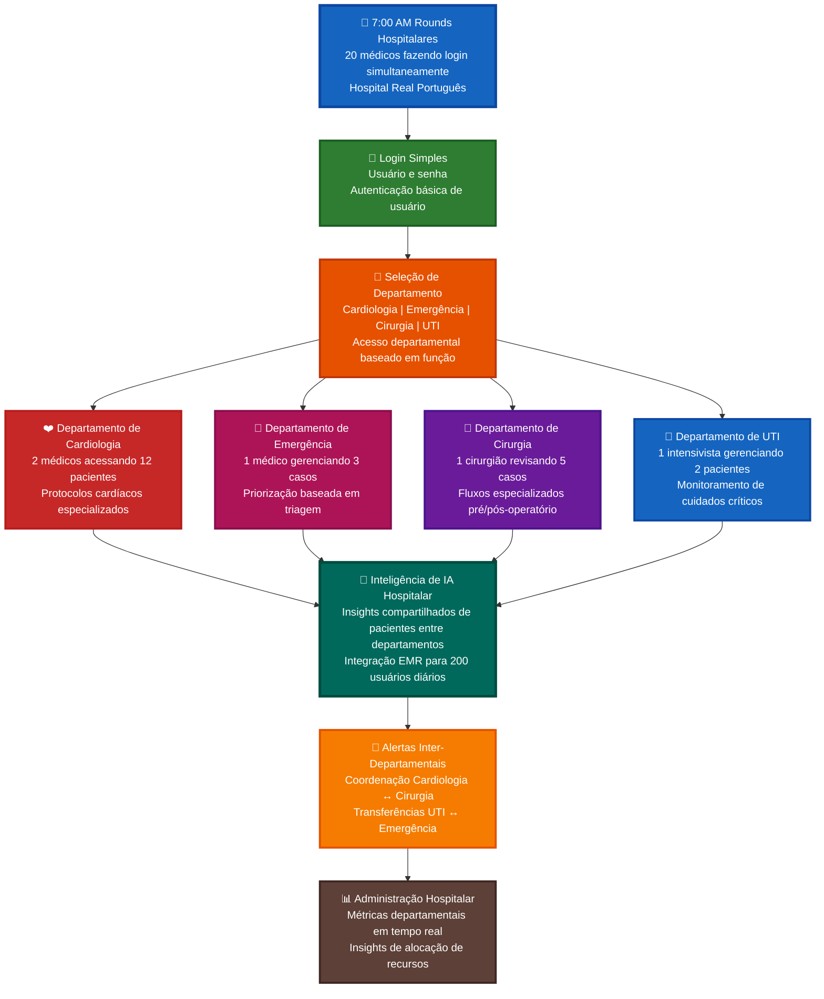
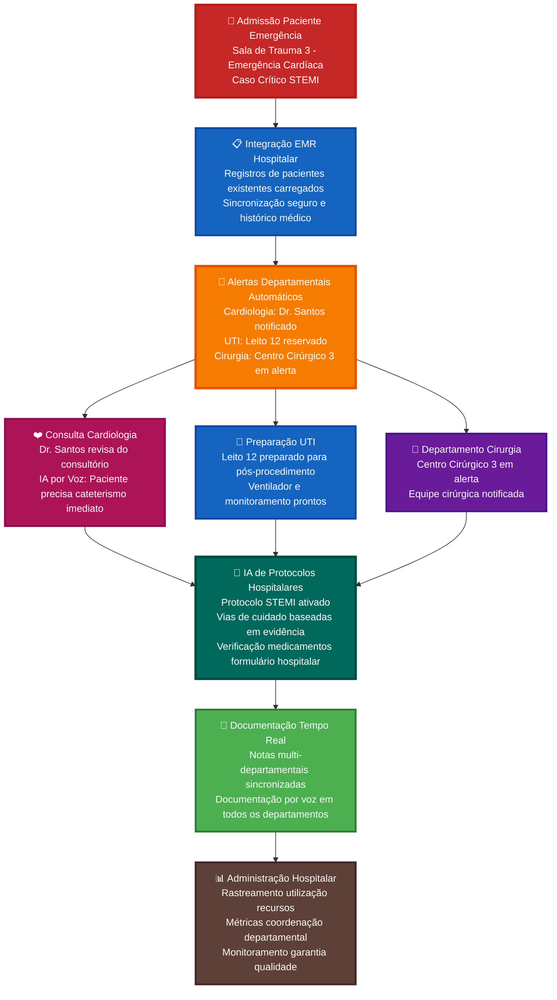
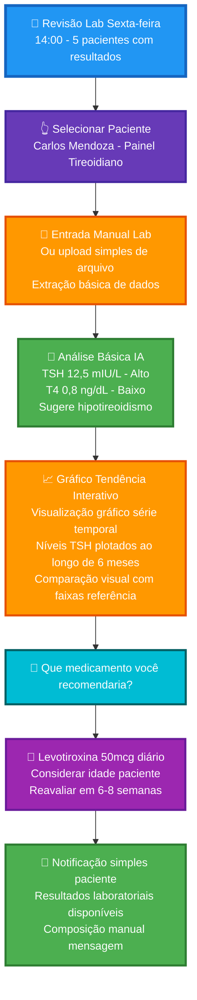
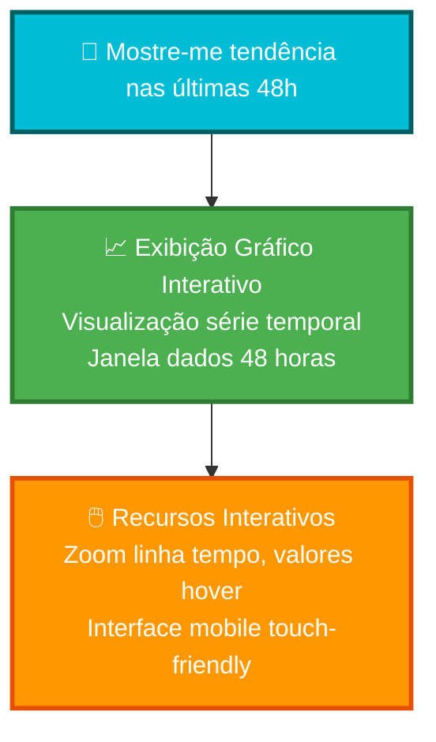
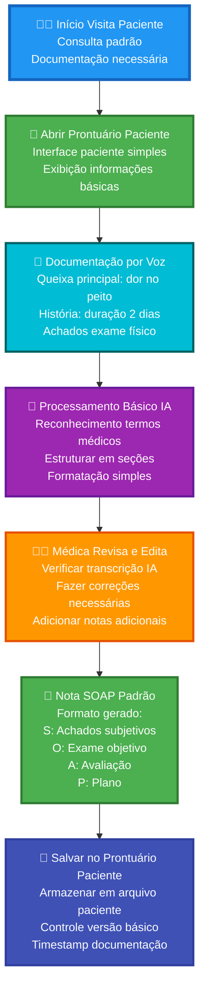

# 🏥 Casos de Uso e Fluxos Departamentais de Escala Hospitalar

Esta seção delineia casos de uso abrangentes para a plataforma médica Prontuário MVP, focando em funcionalidades que atendem instituições de médio porte como o Hospital Real Português com 200 usuários diários em múltiplos departamentos e especialidades.

---

## 🏥 Caso de Uso 1: Coordenação de Rounds Matinais Multi-Departamentais

### Contexto: Hospital Real Português - 7:00 AM Rounds Hospitalares

### Escala: 20 médicos em 4 departamentos principais iniciando rounds matinais simultaneamente

- **Departamento de Cardiologia**: 2 médicos revisando 12 pacientes cardíacos
- **Medicina de Emergência**: 1 médico gerenciando 3 casos de emergência  
- **Departamento de Cirurgia**: 1 cirurgião revisando 5 pacientes pré/pós-operatório
- **Unidades de UTI**: 1 intensivista gerenciando 2 pacientes de cuidados críticos

### Fluxo de Trabalho

### Benefícios Empresariais

- **🏥 Eficiência de Escala Hospitalar**: 20 médicos iniciando rounds simultaneamente
- **🔄 Coordenação Departamental**: Comunicação inter-departamental em tempo real
- **📊 Supervisão Administrativa**: Métricas hospitalares e gestão de recursos
- **🤖 Inteligência Compartilhada**: Insights de IA acessíveis em todos os departamentos

---

## 🚨 Caso de Uso 2: Integração do Departamento de Emergência com Sistemas Hospitalares

### Contexto: Departamento de Medicina de Emergência - Operações 24/7
### Escala: 3 médicos de emergência, 5 enfermeiros, 1.000+ visitas de emergência anuais

- **Desafio de Integração**: Casos de emergência requerendo coordenação hospitalar imediata
- **Integração EMR**: Sincronização em tempo real com prontuários eletrônicos médicos hospitalares existentes
- **Alertas Inter-Departamentais**: Coordenação UTI, Cirurgia, Cardiologia para casos críticos

### Fluxo de Trabalho de Emergência Empresarial

### Ganhos de Eficiência de Consulta

- **📊 Preparação Pré-visita**: 2 minutos vs 10 minutos revisão de prontuário
- **🎤 Documentação por Voz**: Anotações em tempo real enquanto conversa
- **🤖 Assistência Médica Básica**: Sugestões simples de tratamento
- **📝 Notas Simplificadas**: Suporte documentação estruturada

---

## 🔬 Caso de Uso 3: Revisão Simples de Resultados Laboratoriais

### Persona: Dr. Roberto Silva - Endocrinologista

- **Experiência**: 10 anos, especialista em diabetes e distúrbios hormonais
- **Contexto**: Sessão semanal de revisão de resultados laboratoriais
- **Desafio**: Analisar painéis laboratoriais eficientemente

### Fluxo de Trabalho Básico de Revisão Laboratorial

### Recursos Básicos de Laboratório

- **📄 Entrada Simples**: Entrada manual ou upload básico de arquivo
- **📈 Gráficos Tendência Interativos**: Gráficos visuais série temporal com comparação histórica
- **⚠️ Sinalizar Valores**: Destacar resultados anormais
- **💊 Orientação Básica**: Sugestões simples de tratamento
- **💊 Busca Medicamentos**: Informações básicas medicamentos e interações

### 🎤 Exemplo Consulta por Voz: "Mostre-me tendência nas últimas 48h"

Quando um médico diz **"Mostre-me tendência nas últimas 48h"**, o sistema gera:

**Saída Visual**: 
- 📈 **Gráfico linha série temporal** com eixo-X mostrando linha tempo 48 horas
- 📊 **Eixo-Y** mostrando valores parâmetros (PA, frequência cardíaca, glicose, etc.)
- 🎯 **Pontos interativos** para cada medição com detalhes hover
- 📱 **Touch-friendly** zoom e pan para dispositivos móveis
- ⚠️ **Marcadores alerta** para valores fora da faixa destacados no gráfico

---

## 📱 Caso de Uso 4: Documentação Básica de Pacientes

### Persona: Dra. Patricia Lima - Clínica Geral

- **Experiência**: 10 anos em medicina geral
- **Contexto**: Visitas padrão de pacientes e documentação
- **Desafio**: Documentação eficiente sem complexidade

### Fluxo de Documentação Básica

### Benefícios de Documentação

- **🎤 Entrada por Voz**: Documentação hands-free
- **🤖 Processamento IA**: Reconhecimento básico termos médicos
- **📝 Formato Padrão**: Geração nota SOAP
- **💾 Armazenamento Simples**: Gestão básica registros

---